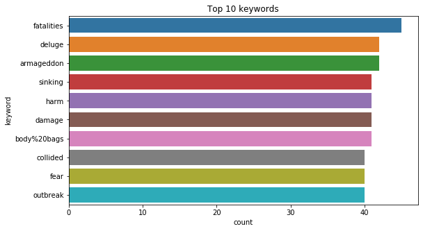
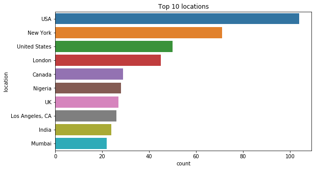

---
title: "Real or Not? NLP with Disaster Tweets"
subtitle: "Predict which Tweets are about real disasters and which ones are not"
summary: "The challenge is to build a machine learning model that predicts which Tweets are about real disasters and which one’s aren’t. For this competition we used Support Vector Machine to predict the target, we scored 0.75255 accuracy and number 1997 on the leaderboard. https://www.kaggle.com/c/nlp-getting-started/leaderboard#score"

authors:
- admin
tags: []
categories: []
date: "2020-03-03"
lastMod: ""
featured: false
draft: false

# Featured image
# To use, add an image named `featured.jpg/png` to your page's folder. 
image:
  caption: "https://www.kaggle.com/c/nlp-getting-started/overview"
  focal_point: ""
  
# Custom links (optional).
#  Uncomment and edit lines below to show custom links.
# links:
# - name: Follow
#   url: https://twitter.com
#   icon_pack: fab
#   icon: twitter

url_code: "https://github.com/AmnahAli/academic-kickstart/blob/master/content/post/Jupyter/index.ipynb"
url_pdf: ""
url_slides: ""
url_video: ""


# Projects (optional).
#   Associate this post with one or more of your projects.
#   Simply enter your project's folder or file name without extension.
#   E.g. `projects = ["internal-project"]` references 
#   `content/project/deep-learning/index.md`.
#   Otherwise, set `projects = []`.
projects: []
---
# About this Notebook
## This is classifier practices on one of Kaggle problems using machine learning methods for Natural Language Processing
##  Real or Not? NLP with Disaster Tweets
Predict which Tweets are about real disasters and which ones are not
https://www.kaggle.com/c/nlp-getting-started/leaderboard#score

For this competition we used Support Vector Machine to predict the target, we scored 0.75255 accuracy and number 1997 on the leaderboard. 

Content: 
* Load librarys
* Load Data and data analysis 
* Model Selection
    * Support Vector Machine
    * k-Nearest Neighbor
    * Decision tree
    * Naive Bayes Classifiers
    * Keras TensorFlow
* Submission 

# Load librasrys


```python
import numpy as np 
import pandas as pd 
import seaborn as sns
from matplotlib import pyplot as plt

import requests
from contextlib import closing
import csv

from sklearn.model_selection import cross_validate
from sklearn.model_selection import train_test_split
from sklearn.feature_extraction.text import CountVectorizer
from sklearn.model_selection import KFold , GridSearchCV
from sklearn import feature_extraction, linear_model, model_selection, preprocessing
from sklearn.metrics import accuracy_score
from sklearn.metrics import precision_score
from sklearn.metrics import recall_score
from sklearn.metrics import f1_score
from sklearn.metrics import confusion_matrix
from sklearn.metrics import classification_report
from sklearn.model_selection import StratifiedKFold

from sklearn.linear_model import RidgeClassifier
from sklearn import tree
from sklearn.neighbors import KNeighborsClassifier
from sklearn.svm import SVC
from sklearn.naive_bayes import GaussianNB
```

# Load Data 


```python
train_df = pd.read_csv("/Users/mamo/Python_Project/train.csv")
test_df = pd.read_csv("/Users/mamo/Python_Project/test.csv")
```


```python
print (train_df.shape, test_df.shape)
```

    (7613, 5) (3263, 4)


```python
train_df.head()
```


<div>
<style scoped>
    .dataframe tbody tr th:only-of-type {
        vertical-align: middle;
    }

    .dataframe tbody tr th {
        vertical-align: top;
    }

    .dataframe thead th {
        text-align: right;
    }
</style>
<table border="1" class="dataframe">
  <thead>
    <tr style="text-align: right;">
      <th></th>
      <th>id</th>
      <th>keyword</th>
      <th>location</th>
      <th>text</th>
      <th>target</th>
    </tr>
  </thead>
  <tbody>
    <tr>
      <td>0</td>
      <td>1</td>
      <td>NaN</td>
      <td>NaN</td>
      <td>Our Deeds are the Reason of this #earthquake M...</td>
      <td>1</td>
    </tr>
    <tr>
      <td>1</td>
      <td>4</td>
      <td>NaN</td>
      <td>NaN</td>
      <td>Forest fire near La Ronge Sask. Canada</td>
      <td>1</td>
    </tr>
    <tr>
      <td>2</td>
      <td>5</td>
      <td>NaN</td>
      <td>NaN</td>
      <td>All residents asked to 'shelter in place' are ...</td>
      <td>1</td>
    </tr>
    <tr>
      <td>3</td>
      <td>6</td>
      <td>NaN</td>
      <td>NaN</td>
      <td>13,000 people receive #wildfires evacuation or...</td>
      <td>1</td>
    </tr>
    <tr>
      <td>4</td>
      <td>7</td>
      <td>NaN</td>
      <td>NaN</td>
      <td>Just got sent this photo from Ruby #Alaska as ...</td>
      <td>1</td>
    </tr>
  </tbody>
</table>
</div>


```python
train_df.isnull().sum()
```


    id             0
    keyword       61
    location    2533
    text           0
    target         0
    dtype: int64


```python
test_df.head()
```


<div>
<style scoped>
    .dataframe tbody tr th:only-of-type {
        vertical-align: middle;
    }

    .dataframe tbody tr th {
        vertical-align: top;
    }

    .dataframe thead th {
        text-align: right;
    }
</style>
<table border="1" class="dataframe">
  <thead>
    <tr style="text-align: right;">
      <th></th>
      <th>id</th>
      <th>keyword</th>
      <th>location</th>
      <th>text</th>
    </tr>
  </thead>
  <tbody>
    <tr>
      <td>0</td>
      <td>0</td>
      <td>NaN</td>
      <td>NaN</td>
      <td>Just happened a terrible car crash</td>
    </tr>
    <tr>
      <td>1</td>
      <td>2</td>
      <td>NaN</td>
      <td>NaN</td>
      <td>Heard about #earthquake is different cities, s...</td>
    </tr>
    <tr>
      <td>2</td>
      <td>3</td>
      <td>NaN</td>
      <td>NaN</td>
      <td>there is a forest fire at spot pond, geese are...</td>
    </tr>
    <tr>
      <td>3</td>
      <td>9</td>
      <td>NaN</td>
      <td>NaN</td>
      <td>Apocalypse lighting. #Spokane #wildfires</td>
    </tr>
    <tr>
      <td>4</td>
      <td>11</td>
      <td>NaN</td>
      <td>NaN</td>
      <td>Typhoon Soudelor kills 28 in China and Taiwan</td>
    </tr>
  </tbody>
</table>
</div>


```python
test_df.isnull().sum()
```


    id             0
    keyword       26
    location    1105
    text           0
    dtype: int64


```python
# Thanks to https://www.kaggle.com/gunesevitan/nlp-with-disaster-tweets-eda-cleaning-and-bert
# Most common "keywords"

plt.figure(figsize=(9,5))

sns.countplot(y=train_df.keyword, order = train_df.keyword.value_counts().iloc[:10].index)
plt.title('Top 10 keywords')
plt.show()
```





```python
#thanks to https://www.kaggle.com/gunesevitan/nlp-with-disaster-tweets-eda-cleaning-and-bert
# Top 20 Locations

plt.figure(figsize=(9,5))
sns.countplot(y=train_df.location, order = train_df.location.value_counts().iloc[:10].index)

plt.title('Top 10 locations')
plt.show()
```





## Tokinize text 
Tokenization is a process that splits an input sequence into so-called tokens where the tokens can be a word, sentence, paragraph etc. Then transform text (tokens to a vector) into a meaningful vector (or array) of numbers. 


```python
tokenizer = CountVectorizer()
train_vectors = tokenizer.fit_transform(train_df['text'])
```


```python
## we use .todense() here because these vectors are "sparse" (only non-zero elements are kept to save space)
print(train_vectors[0].todense().shape)
print(train_vectors[0].todense())
```

    (1, 21637)
    [[0 0 0 ... 0 0 0]]


# Model Selection
## Support Vector Machine


```python
# Split traning set for tarning and testing
X_train, X_test, y_train, y_test = train_test_split(train_vectors, train_df["target"], test_size=0.30, random_state=42)
```


```python
# Cross_Validation
kf = KFold(n_splits=5, random_state=1337, shuffle=True)
kf.get_n_splits(X_train) # returns the number of splitting iterations in the cross-validator
print(kf) 
```

    KFold(n_splits=5, random_state=1337, shuffle=True)


```python
# Thanks to https://www.kaggle.com/oldelephant/disaster-tweets-svm
# Hyperparameter tuning
parameters = { 
    'gamma': [0.001, 0.01, 0.1, 0.4, 0.5, 0.6, 0.7, 1], 
    'kernel': ['rbf'], 
    'C': [0.001, 0.01, 0.1, 1, 1.5, 2, 3, 10],
}
clf = GridSearchCV(SVC(), parameters, cv=10, n_jobs=-1).fit(X_train, y_train)
```


```python
# Cross_Validation
scores = model_selection.cross_val_score(clf, train_vectors, train_df["target"], cv=3, scoring="f1")
scores
```


    array([0.61341108, 0.57644394, 0.65988216])


```python
# model accuracy on the test set
clf.score(X_test, y_test)
```


    0.809106830122592


```python
# Model perdictoin
test_vectors = tokenizer.transform(test_df['text'])
predictions = clf.predict(X_test)
```


```python
accuracy_score(y_test, predictions)
```


    0.809106830122592


```python
# Confusion matrix
print(pd.crosstab(y_test, predictions, rownames=['True'], colnames=['Predicted'], margins=True))
```

    Predicted     0    1   All
    True                      
    0          1212  106  1318
    1           330  636   966
    All        1542  742  2284


## k-Nearest Neighbor


```python
knn = KNeighborsClassifier(n_neighbors=3)
```


```python
knn.fit(X_train, y_train)
```


    KNeighborsClassifier(algorithm='auto', leaf_size=30, metric='minkowski',
                         metric_params=None, n_jobs=None, n_neighbors=3, p=2,
                         weights='uniform')


```python
knn.score(X_test, y_test)
```


    0.6882661996497373


```python
predictions2= knn.predict(X_test)
```


```python
accuracy_score(y_test, predictions2)
```


    0.6882661996497373


```python
print(pd.crosstab(y_test, predictions2, rownames=['True'], colnames=['Predicted'], margins=True))
```

    Predicted     0    1   All
    True                      
    0          1270   48  1318
    1           664  302   966
    All        1934  350  2284


## Decision tree


```python
from sklearn import tree
tree = tree.DecisionTreeClassifier(random_state=1234)
```


```python
scores = model_selection.cross_val_score(tree, train_vectors, train_df["target"], cv=5, scoring="f1")
scores
```


    array([0.58218549, 0.48229342, 0.50958466, 0.56458512, 0.59665145])


```python
tree.fit(X_train, y_train)
```


    DecisionTreeClassifier(class_weight=None, criterion='gini', max_depth=None,
                           max_features=None, max_leaf_nodes=None,
                           min_impurity_decrease=0.0, min_impurity_split=None,
                           min_samples_leaf=1, min_samples_split=2,
                           min_weight_fraction_leaf=0.0, presort=False,
                           random_state=1234, splitter='best')


```python
tree.score(X_train, y_train)
```


    0.9971852129855507


```python
predictions3= tree.predict(X_test)
```


```python
tree.score(X_test, y_test)
```


    0.7197898423817863


```python
accuracy_score(y_test, predictions3)
```


    0.7197898423817863


```python
# Confusion matrix
print(pd.crosstab(y_test, predictions3, rownames=['True'], colnames=['Predicted'], margins=True))
```

    Predicted     0    1   All
    True                      
    0          1039  279  1318
    1           361  605   966
    All        1400  884  2284


##  Naive Bayes Classifiers


```python
from sklearn.naive_bayes import MultinomialNB
from sklearn.naive_bayes import GaussianNB
```


```python
# Fitting a simple Naive Bayes on Counts
clf_NB = MultinomialNB()
scores = model_selection.cross_val_score(clf_NB, train_vectors, train_df["target"], cv=5, scoring="f1")
scores
```


    array([0.6507019 , 0.62611276, 0.69247626, 0.65555556, 0.74369748])


```python
clf_NB.fit(train_vectors, train_df["target"])
```


    MultinomialNB(alpha=1.0, class_prior=None, fit_prior=True)


```python
clf_NB.score(X_train, y_train)
```


    0.9044848939763558


```python
predictions4= tree.predict(X_test)
```


```python
accuracy_score(y_test, predictions4)
```


    0.7197898423817863


# Submit


```python
sample_submission = pd.read_csv("sample_submission.csv")
```


```python
sample_submission["target"] = clf.predict(test_vectors)
```


```python
sample_submission.head()
```


<div>
<style scoped>
    .dataframe tbody tr th:only-of-type {
        vertical-align: middle;
    }

    .dataframe tbody tr th {
        vertical-align: top;
    }

    .dataframe thead th {
        text-align: right;
    }
</style>
<table border="1" class="dataframe">
  <thead>
    <tr style="text-align: right;">
      <th></th>
      <th>id</th>
      <th>target</th>
    </tr>
  </thead>
  <tbody>
    <tr>
      <td>0</td>
      <td>0</td>
      <td>0</td>
    </tr>
    <tr>
      <td>1</td>
      <td>2</td>
      <td>0</td>
    </tr>
    <tr>
      <td>2</td>
      <td>3</td>
      <td>1</td>
    </tr>
    <tr>
      <td>3</td>
      <td>9</td>
      <td>0</td>
    </tr>
    <tr>
      <td>4</td>
      <td>11</td>
      <td>1</td>
    </tr>
  </tbody>
</table>
</div>


```python
sample_submission.to_csv("submission.csv", index=False)
```

## Keras TensorFlow

### Thanks to  https://www.kaggle.com/alexandrucodrescu/tweet-nlp-tensorflow-keras


```python
# Import libraries

!pip install tensorflow
#!wget --quiet https://raw.githubusercontent.com/tensorflow/models/master/official/nlp/bert/tokenization.py


import numpy as np
import pandas as pd
import matplotlib.pyplot as plt
import seaborn as sns
import string
from collections import defaultdict
import csv
import re
#from tabulate import tabulate
import tensorflow as tf
from tensorflow import keras
from tensorflow_core.python.keras.utils.data_utils import Sequence
from tensorflow.keras.utils import Sequence


import tensorflow as tf
from tensorflow.keras.models import Sequential
from tensorflow.keras.layers import Dropout
from tensorflow.keras.layers import Embedding, LSTM, Dense, Bidirectional
from tensorflow.keras.preprocessing.text import Tokenizer
from tensorflow.keras.preprocessing.sequence import pad_sequences
from tensorflow.keras.utils import to_categorical
from tensorflow.keras.layers import SimpleRNN


```

    Requirement already satisfied: tensorflow in /Users/mamo/opt/anaconda3/lib/python3.7/site-packages (2.1.0)
    Requirement already satisfied: tensorflow-estimator<2.2.0,>=2.1.0rc0 in /Users/mamo/opt/anaconda3/lib/python3.7/site-packages (from tensorflow) (2.1.0)
    Requirement already satisfied: protobuf>=3.8.0 in /Users/mamo/opt/anaconda3/lib/python3.7/site-packages (from tensorflow) (3.11.3)
    Requirement already satisfied: opt-einsum>=2.3.2 in /Users/mamo/opt/anaconda3/lib/python3.7/site-packages (from tensorflow) (3.1.0)
    Requirement already satisfied: google-pasta>=0.1.6 in /Users/mamo/opt/anaconda3/lib/python3.7/site-packages (from tensorflow) (0.1.8)
    Requirement already satisfied: numpy<2.0,>=1.16.0 in /Users/mamo/opt/anaconda3/lib/python3.7/site-packages (from tensorflow) (1.17.2)
    Requirement already satisfied: wheel>=0.26; python_version >= "3" in /Users/mamo/opt/anaconda3/lib/python3.7/site-packages (from tensorflow) (0.33.6)
    Requirement already satisfied: keras-preprocessing>=1.1.0 in /Users/mamo/opt/anaconda3/lib/python3.7/site-packages (from tensorflow) (1.1.0)
    Requirement already satisfied: tensorboard<2.2.0,>=2.1.0 in /Users/mamo/opt/anaconda3/lib/python3.7/site-packages (from tensorflow) (2.1.0)
    Requirement already satisfied: wrapt>=1.11.1 in /Users/mamo/opt/anaconda3/lib/python3.7/site-packages (from tensorflow) (1.11.2)
    Requirement already satisfied: grpcio>=1.8.6 in /Users/mamo/opt/anaconda3/lib/python3.7/site-packages (from tensorflow) (1.27.2)
    Requirement already satisfied: scipy==1.4.1; python_version >= "3" in /Users/mamo/opt/anaconda3/lib/python3.7/site-packages (from tensorflow) (1.4.1)
    Requirement already satisfied: keras-applications>=1.0.8 in /Users/mamo/opt/anaconda3/lib/python3.7/site-packages (from tensorflow) (1.0.8)
    Requirement already satisfied: termcolor>=1.1.0 in /Users/mamo/opt/anaconda3/lib/python3.7/site-packages (from tensorflow) (1.1.0)
    Requirement already satisfied: six>=1.12.0 in /Users/mamo/opt/anaconda3/lib/python3.7/site-packages (from tensorflow) (1.12.0)
    Requirement already satisfied: astor>=0.6.0 in /Users/mamo/opt/anaconda3/lib/python3.7/site-packages (from tensorflow) (0.8.1)
    Requirement already satisfied: gast==0.2.2 in /Users/mamo/opt/anaconda3/lib/python3.7/site-packages (from tensorflow) (0.2.2)
    Requirement already satisfied: absl-py>=0.7.0 in /Users/mamo/opt/anaconda3/lib/python3.7/site-packages (from tensorflow) (0.9.0)
    Requirement already satisfied: setuptools in /Users/mamo/opt/anaconda3/lib/python3.7/site-packages (from protobuf>=3.8.0->tensorflow) (41.4.0)
    Requirement already satisfied: google-auth<2,>=1.6.3 in /Users/mamo/opt/anaconda3/lib/python3.7/site-packages (from tensorboard<2.2.0,>=2.1.0->tensorflow) (1.11.2)
    Requirement already satisfied: requests<3,>=2.21.0 in /Users/mamo/opt/anaconda3/lib/python3.7/site-packages (from tensorboard<2.2.0,>=2.1.0->tensorflow) (2.22.0)
    Requirement already satisfied: markdown>=2.6.8 in /Users/mamo/opt/anaconda3/lib/python3.7/site-packages (from tensorboard<2.2.0,>=2.1.0->tensorflow) (3.2.1)
    Requirement already satisfied: werkzeug>=0.11.15 in /Users/mamo/opt/anaconda3/lib/python3.7/site-packages (from tensorboard<2.2.0,>=2.1.0->tensorflow) (0.16.0)
    Requirement already satisfied: google-auth-oauthlib<0.5,>=0.4.1 in /Users/mamo/opt/anaconda3/lib/python3.7/site-packages (from tensorboard<2.2.0,>=2.1.0->tensorflow) (0.4.1)
    Requirement already satisfied: h5py in /Users/mamo/opt/anaconda3/lib/python3.7/site-packages (from keras-applications>=1.0.8->tensorflow) (2.9.0)
    Requirement already satisfied: pyasn1-modules>=0.2.1 in /Users/mamo/opt/anaconda3/lib/python3.7/site-packages (from google-auth<2,>=1.6.3->tensorboard<2.2.0,>=2.1.0->tensorflow) (0.2.8)
    Requirement already satisfied: cachetools<5.0,>=2.0.0 in /Users/mamo/opt/anaconda3/lib/python3.7/site-packages (from google-auth<2,>=1.6.3->tensorboard<2.2.0,>=2.1.0->tensorflow) (4.0.0)
    Requirement already satisfied: rsa<4.1,>=3.1.4 in /Users/mamo/opt/anaconda3/lib/python3.7/site-packages (from google-auth<2,>=1.6.3->tensorboard<2.2.0,>=2.1.0->tensorflow) (4.0)
    Requirement already satisfied: certifi>=2017.4.17 in /Users/mamo/opt/anaconda3/lib/python3.7/site-packages (from requests<3,>=2.21.0->tensorboard<2.2.0,>=2.1.0->tensorflow) (2019.9.11)
    Requirement already satisfied: urllib3!=1.25.0,!=1.25.1,<1.26,>=1.21.1 in /Users/mamo/opt/anaconda3/lib/python3.7/site-packages (from requests<3,>=2.21.0->tensorboard<2.2.0,>=2.1.0->tensorflow) (1.24.2)
    Requirement already satisfied: idna<2.9,>=2.5 in /Users/mamo/opt/anaconda3/lib/python3.7/site-packages (from requests<3,>=2.21.0->tensorboard<2.2.0,>=2.1.0->tensorflow) (2.8)
    Requirement already satisfied: chardet<3.1.0,>=3.0.2 in /Users/mamo/opt/anaconda3/lib/python3.7/site-packages (from requests<3,>=2.21.0->tensorboard<2.2.0,>=2.1.0->tensorflow) (3.0.4)
    Requirement already satisfied: requests-oauthlib>=0.7.0 in /Users/mamo/opt/anaconda3/lib/python3.7/site-packages (from google-auth-oauthlib<0.5,>=0.4.1->tensorboard<2.2.0,>=2.1.0->tensorflow) (1.3.0)
    Requirement already satisfied: pyasn1<0.5.0,>=0.4.6 in /Users/mamo/opt/anaconda3/lib/python3.7/site-packages (from pyasn1-modules>=0.2.1->google-auth<2,>=1.6.3->tensorboard<2.2.0,>=2.1.0->tensorflow) (0.4.8)
    Requirement already satisfied: oauthlib>=3.0.0 in /Users/mamo/opt/anaconda3/lib/python3.7/site-packages (from requests-oauthlib>=0.7.0->google-auth-oauthlib<0.5,>=0.4.1->tensorboard<2.2.0,>=2.1.0->tensorflow) (3.1.0)


```python
import re

test_str = train_df.loc[417, 'text']

def clean_text(text):
    text = re.sub(r'https?://\S+', '', text) # Remove link
    text = re.sub(r'\n',' ', text) # Remove line breaks
    text = re.sub('\s+', ' ', text).strip() # Remove leading, trailing, and extra spaces
    return text

print("Original text: " + test_str)
print("Cleaned text: " + clean_text(test_str))
```

    Original text: Arson suspect linked to 30 fires caught in Northern California http://t.co/mmGsyAHDzb
    Cleaned text: Arson suspect linked to 30 fires caught in Northern California


```python
def find_hashtags(tweet):
    return " ".join([match.group(0)[1:] for match in re.finditer(r"#\w+", tweet)]) or 'no'

def find_mentions(tweet):
    return " ".join([match.group(0)[1:] for match in re.finditer(r"@\w+", tweet)]) or 'no'

def find_links(tweet):
    return " ".join([match.group(0)[:] for match in re.finditer(r"https?://\S+", tweet)]) or 'no'

def process_text(df):
    
    df['text_clean'] = df['text'].apply(lambda x: clean_text(x))
    df['hashtags'] = df['text'].apply(lambda x: find_hashtags(x))
    df['mentions'] = df['text'].apply(lambda x: find_mentions(x))
    df['links'] = df['text'].apply(lambda x: find_links(x))
    # df['hashtags'].fillna(value='no', inplace=True)
    # df['mentions'].fillna(value='no', inplace=True)
    
    return df
    
train_df = process_text(train_df)
test_df = process_text(test_df)
```


```python
train_df.head()
```


<div>
<style scoped>
    .dataframe tbody tr th:only-of-type {
        vertical-align: middle;
    }

    .dataframe tbody tr th {
        vertical-align: top;
    }

    .dataframe thead th {
        text-align: right;
    }
</style>
<table border="1" class="dataframe">
  <thead>
    <tr style="text-align: right;">
      <th></th>
      <th>id</th>
      <th>keyword</th>
      <th>location</th>
      <th>text</th>
      <th>target</th>
      <th>text_clean</th>
      <th>hashtags</th>
      <th>mentions</th>
      <th>links</th>
    </tr>
  </thead>
  <tbody>
    <tr>
      <td>0</td>
      <td>1</td>
      <td>NaN</td>
      <td>NaN</td>
      <td>Our Deeds are the Reason of this #earthquake M...</td>
      <td>1</td>
      <td>Our Deeds are the Reason of this #earthquake M...</td>
      <td>earthquake</td>
      <td>no</td>
      <td>no</td>
    </tr>
    <tr>
      <td>1</td>
      <td>4</td>
      <td>NaN</td>
      <td>NaN</td>
      <td>Forest fire near La Ronge Sask. Canada</td>
      <td>1</td>
      <td>Forest fire near La Ronge Sask. Canada</td>
      <td>no</td>
      <td>no</td>
      <td>no</td>
    </tr>
    <tr>
      <td>2</td>
      <td>5</td>
      <td>NaN</td>
      <td>NaN</td>
      <td>All residents asked to 'shelter in place' are ...</td>
      <td>1</td>
      <td>All residents asked to 'shelter in place' are ...</td>
      <td>no</td>
      <td>no</td>
      <td>no</td>
    </tr>
    <tr>
      <td>3</td>
      <td>6</td>
      <td>NaN</td>
      <td>NaN</td>
      <td>13,000 people receive #wildfires evacuation or...</td>
      <td>1</td>
      <td>13,000 people receive #wildfires evacuation or...</td>
      <td>wildfires</td>
      <td>no</td>
      <td>no</td>
    </tr>
    <tr>
      <td>4</td>
      <td>7</td>
      <td>NaN</td>
      <td>NaN</td>
      <td>Just got sent this photo from Ruby #Alaska as ...</td>
      <td>1</td>
      <td>Just got sent this photo from Ruby #Alaska as ...</td>
      <td>Alaska wildfires</td>
      <td>no</td>
      <td>no</td>
    </tr>
  </tbody>
</table>
</div>


```python
cuvinte_text = []
for i in range(0,7613):
    cuvinte_text.append(train_df['text_clean'][i].split())
```


```python
contor_cuvinte = defaultdict(int)

for doc in cuvinte_text:
    for word in doc:
        contor_cuvinte[word] += 1

PRIMELE_N_CUVINTE = 1000
        
# transformam dictionarul in lista de tupluri ['cuvant1', frecventa1, 'cuvant2': frecventa2]
perechi_cuvinte_frecventa = list(contor_cuvinte.items())

# sortam descrescator lista de tupluri dupa frecventa
perechi_cuvinte_frecventa = sorted(perechi_cuvinte_frecventa, key=lambda kv: kv[1], reverse=True)

# extragem primele 1000 cele mai frecvente cuvinte din toate textele
perechi_cuvinte_frecventa = perechi_cuvinte_frecventa[0:PRIMELE_N_CUVINTE]

print ("Primele 10 cele mai frecvente cuvinte ", perechi_cuvinte_frecventa[0:10])
```

    Primele 10 cele mai frecvente cuvinte  [('the', 2575), ('a', 1845), ('to', 1805), ('in', 1757), ('of', 1722), ('and', 1302), ('I', 1197), ('for', 820), ('is', 814), ('on', 773)]


```python
list_of_selected_words = []
for cuvant, frecventa in perechi_cuvinte_frecventa:
    list_of_selected_words.append(cuvant)
### numaram cuvintele din toate documentele ###
```


```python
def get_bow(text, lista_de_cuvinte):
    '''
    returneaza BoW corespunzator unui text impartit in cuvinte
    in functie de lista de cuvinte selectate
    '''
    contor = dict()
    cuvinte = set(lista_de_cuvinte)
    for cuvant in cuvinte:
        contor[cuvant] = 0
    for cuvant in text:
        if cuvant in cuvinte:
            contor[cuvant] += 1
    return contor
```


```python
def get_bow_pe_corpus(corpus, lista):
    '''
    returneaza BoW normalizat
    corespunzator pentru un intreg set de texte
    sub forma de matrice np.array
    '''
    bow = np.zeros((len(corpus), len(lista)))
    for idx, doc in enumerate(corpus):
        bow_dict = get_bow(doc, lista)
        ''' 
            bow e dictionar.
            bow.values() e un obiect de tipul dict_values 
            care contine valorile dictionarului
            trebuie convertit in lista apoi in numpy.array
        '''
        v = np.array(list(bow_dict.values()))
        #v = v / np.sqrt(np.sum(v ** 2))
        bow[idx] = v
    return bow
```


```python
data_bow = get_bow_pe_corpus(cuvinte_text, list_of_selected_words)
print ("Data bow are shape: ", data_bow.shape)
```

    Data bow are shape:  (7613, 1000)


```python
train_df.head()
```


<div>
<style scoped>
    .dataframe tbody tr th:only-of-type {
        vertical-align: middle;
    }

    .dataframe tbody tr th {
        vertical-align: top;
    }

    .dataframe thead th {
        text-align: right;
    }
</style>
<table border="1" class="dataframe">
  <thead>
    <tr style="text-align: right;">
      <th></th>
      <th>id</th>
      <th>keyword</th>
      <th>location</th>
      <th>text</th>
      <th>target</th>
      <th>text_clean</th>
      <th>hashtags</th>
      <th>mentions</th>
      <th>links</th>
    </tr>
  </thead>
  <tbody>
    <tr>
      <td>0</td>
      <td>1</td>
      <td>NaN</td>
      <td>NaN</td>
      <td>Our Deeds are the Reason of this #earthquake M...</td>
      <td>1</td>
      <td>Our Deeds are the Reason of this #earthquake M...</td>
      <td>earthquake</td>
      <td>no</td>
      <td>no</td>
    </tr>
    <tr>
      <td>1</td>
      <td>4</td>
      <td>NaN</td>
      <td>NaN</td>
      <td>Forest fire near La Ronge Sask. Canada</td>
      <td>1</td>
      <td>Forest fire near La Ronge Sask. Canada</td>
      <td>no</td>
      <td>no</td>
      <td>no</td>
    </tr>
    <tr>
      <td>2</td>
      <td>5</td>
      <td>NaN</td>
      <td>NaN</td>
      <td>All residents asked to 'shelter in place' are ...</td>
      <td>1</td>
      <td>All residents asked to 'shelter in place' are ...</td>
      <td>no</td>
      <td>no</td>
      <td>no</td>
    </tr>
    <tr>
      <td>3</td>
      <td>6</td>
      <td>NaN</td>
      <td>NaN</td>
      <td>13,000 people receive #wildfires evacuation or...</td>
      <td>1</td>
      <td>13,000 people receive #wildfires evacuation or...</td>
      <td>wildfires</td>
      <td>no</td>
      <td>no</td>
    </tr>
    <tr>
      <td>4</td>
      <td>7</td>
      <td>NaN</td>
      <td>NaN</td>
      <td>Just got sent this photo from Ruby #Alaska as ...</td>
      <td>1</td>
      <td>Just got sent this photo from Ruby #Alaska as ...</td>
      <td>Alaska wildfires</td>
      <td>no</td>
      <td>no</td>
    </tr>
  </tbody>
</table>
</div>


```python
x_val = data_bow[:1000]
x_train = data_bow[1000:]

y_val = train_df['target'][:1000]
y_train = train_df['target'][1000:]
```


```python
z_train = []
for i in range(1000,7613):
    z_train.append(y_train[i])
```


```python
z_val = []
for i in range(0,1000):
    z_val.append(y_val[i])
```


```python
z_train_array = np.asarray(z_train)
z_val_array = np.asarray(z_val)
```


```python
model = keras.Sequential()

model.add(keras.layers.Dense(16,input_shape = (1000,), activation='relu'))
model.add(keras.layers.Dense(1, activation='sigmoid'))

```


```python
model.compile(optimizer='adam',
              loss=tf.keras.losses.BinaryCrossentropy(from_logits=True),
              metrics=['accuracy'])
```


```python
fitmodel = model.fit(x_train, z_train_array, epochs = 10, batch_size = 5121, validation_data = (x_val, z_val_array), verbose = 1)
```

    Train on 6613 samples, validate on 1000 samples
    Epoch 1/10
    6613/6613 [==============================] - 1s 80us/sample - loss: 0.7528 - accuracy: 0.4899 - val_loss: 0.8257 - val_accuracy: 0.4530
    Epoch 2/10
    6613/6613 [==============================] - 0s 11us/sample - loss: 0.7498 - accuracy: 0.5306 - val_loss: 0.8224 - val_accuracy: 0.5110
    Epoch 3/10
    6613/6613 [==============================] - 0s 10us/sample - loss: 0.7470 - accuracy: 0.5659 - val_loss: 0.8192 - val_accuracy: 0.5530
    Epoch 4/10
    6613/6613 [==============================] - 0s 9us/sample - loss: 0.7444 - accuracy: 0.6106 - val_loss: 0.8161 - val_accuracy: 0.5970
    Epoch 5/10
    6613/6613 [==============================] - 0s 10us/sample - loss: 0.7419 - accuracy: 0.6310 - val_loss: 0.8132 - val_accuracy: 0.6390
    Epoch 6/10
    6613/6613 [==============================] - 0s 10us/sample - loss: 0.7394 - accuracy: 0.6505 - val_loss: 0.8103 - val_accuracy: 0.6730
    Epoch 7/10
    6613/6613 [==============================] - 0s 10us/sample - loss: 0.7371 - accuracy: 0.6579 - val_loss: 0.8076 - val_accuracy: 0.6990
    Epoch 8/10
    6613/6613 [==============================] - 0s 10us/sample - loss: 0.7348 - accuracy: 0.6661 - val_loss: 0.8049 - val_accuracy: 0.7280
    Epoch 9/10
    6613/6613 [==============================] - 0s 8us/sample - loss: 0.7325 - accuracy: 0.6705 - val_loss: 0.8023 - val_accuracy: 0.7370
    Epoch 10/10
    6613/6613 [==============================] - 0s 9us/sample - loss: 0.7303 - accuracy: 0.6737 - val_loss: 0.7997 - val_accuracy: 0.7420


```python
cuvinte_text_pred = []
for i in range(0,3263):
    cuvinte_text_pred.append(test_df['text'][i].split())
```


```python
test_data = get_bow_pe_corpus(cuvinte_text_pred, list_of_selected_words)
```


```python
predict = model.predict(test_data)
```


```python
pred = []
for i in range (0,3263):
    pred.append(predict[i][0])
```


```python
norm_pred = []
for i in range (0,3263):
    if pred[i] > 0.5:
        norm_pred.append(1)
    else:
        norm_pred.append(0)
```


```python
submission = pd.DataFrame({
        "id": test_df["id"],
        "target": norm_pred
    })
```


```python
submission.to_csv("submission.csv",index=False)
```


```python
submission.head()
```


<div>
<style scoped>
    .dataframe tbody tr th:only-of-type {
        vertical-align: middle;
    }

    .dataframe tbody tr th {
        vertical-align: top;
    }

    .dataframe thead th {
        text-align: right;
    }
</style>
<table border="1" class="dataframe">
  <thead>
    <tr style="text-align: right;">
      <th></th>
      <th>id</th>
      <th>target</th>
    </tr>
  </thead>
  <tbody>
    <tr>
      <td>0</td>
      <td>0</td>
      <td>0</td>
    </tr>
    <tr>
      <td>1</td>
      <td>2</td>
      <td>0</td>
    </tr>
    <tr>
      <td>2</td>
      <td>3</td>
      <td>0</td>
    </tr>
    <tr>
      <td>3</td>
      <td>9</td>
      <td>0</td>
    </tr>
    <tr>
      <td>4</td>
      <td>11</td>
      <td>0</td>
    </tr>
  </tbody>
</table>
</div>


```python

```

