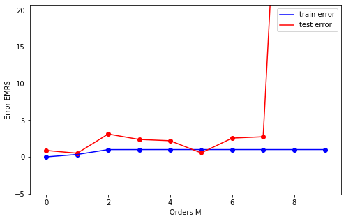
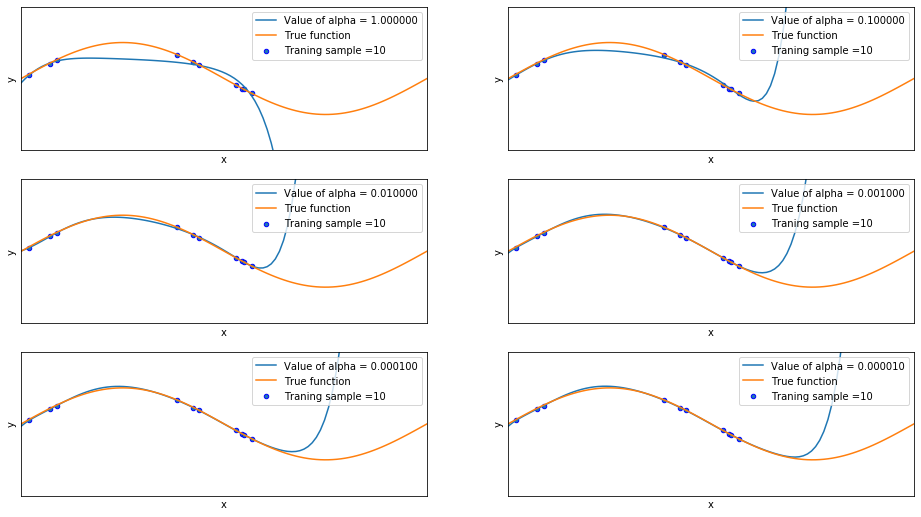
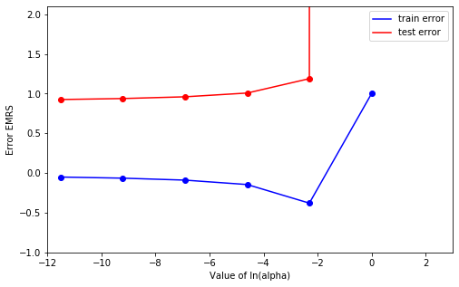
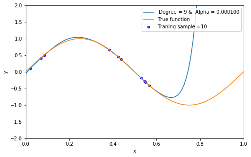

## The assignment steps are not in the exact order as described in the Syllabus, nonetheless every step is well titled


```python
# Import packages:
import math 
import pandas as pd
import numpy as np
import matplotlib.pyplot as plt 

from sklearn.linear_model import Ridge
from sklearn.pipeline import Pipeline
from sklearn.pipeline import make_pipeline
from sklearn.linear_model import LinearRegression

from sklearn.model_selection import cross_val_score
from sklearn.metrics import mean_squared_error
from sklearn.preprocessing import PolynomialFeatures
from sklearn.model_selection import train_test_split
from sklearn.preprocessing import StandardScaler

from prettytable import PrettyTable
from sklearn.model_selection import learning_curve
```

### (a) Generate 20 data pairs (X, Y) using y = sin(2 * pi * X) + N 
   * Use uniform distribution between 0 and 1 for X
   *  Sample N from the normal gaussian distribution 
   * Use 10 for train and 10 for test 
   
(b) Using root mean square error, find weights of polynomial regression for order is 0, 1, 3, 9
  
### (d) Draw a chart of fit data

All these steps are below : 


```python
# Provide data: Generate 20 data pairs (X, Y) using y = sin(2*pi*X) + N 


def true_fun(X):
    return np.sin(2* np.pi * X)


np.random.seed(0)

x = np.sort(np.random.uniform(low=0.0, high=1.0, size=20))   # Use uniform distribution between 0 and 1 for X 
y = true_fun(x) + np.sort(np.random.normal(size=20))*0.01    # Sample N from the normal gaussian distribution


# Use 10 points for train set  and 10 points for test set
x_train = x[:10]
x_test = x[10:]


y_train = y[:10]
y_test = y[10:]


X_train = x_train[:, np.newaxis] # transform x_train
#X_test = x_test[:, np.newaxis] 

degrees = [ 0, 1, 3, 9]     # polynomial regression for order is 0, 1, 3, 9


plt.figure(figsize=(16, 9))
for i in range(len(degrees)):
    ax = plt.subplot(2, len(degrees)/2, i + 1)
    plt.setp(ax, xticks=(), yticks=())
    
    lr=LinearRegression() 
    model = make_pipeline(PolynomialFeatures(degree=degrees[i]), LinearRegression())
    model.fit(x_train[:, np.newaxis], y_train)      # Transform input data: transforming the data to include another axis and fit the model 

    
    scores = cross_val_score(model, x[:, np.newaxis], y, scoring="neg_mean_squared_error", cv=10)   # Evaluate the models using crossvalidation

    X_test = np.linspace(0, 1, 100)  # generate data to plot the true function 

    plt.plot(X_test,true_fun(X_test), label="True function")
    plt.plot(X_test, model.predict(X_test[:, np.newaxis]), label="Degree %d" % degrees[i])   # Predict 
    plt.scatter(x_train, y_train, edgecolor='b', s=20, label="Training points =10")
    plt.xlabel("x")
    plt.ylabel("y")
    plt.xlim((0, 1))
    plt.ylim((-2, 2))
    plt.legend(loc="upper right")
    #plt.title("Degree {}\nMSE = {:.2e}(+/- {:.2e})  RMSE= {:.2e}".format(degrees[i], -scores.mean(), scores.std(), np.sqrt(-scores.mean())))    # Calculate the RMSE Root Mean Square Error 
plt.show()
```


### (b) Using root mean square error, find weights of polynomial regression for order is 0, 1, 3 and  9. 


```python
# Calculate the Root Mean Square Error RMSE for each polynomial degree 0, 1, 3 and 9:

model = make_pipeline(PolynomialFeatures(0), LinearRegression())
model.fit(X_train, y_train)
y_predict0 = model.predict(x_test[:, np.newaxis])
RMSE0 = np.sqrt(mean_squared_error(y_test,y_predict0))
print(RMSE0)


model = make_pipeline(PolynomialFeatures(1), LinearRegression())
model.fit(X_train, y_train)
y_predict1 = model.predict(x_test[:, np.newaxis])
RMSE1 = np.sqrt(mean_squared_error(y_test,y_predict1))
print(RMSE1)


model = make_pipeline(PolynomialFeatures(3), LinearRegression())
model.fit(X_train, y_train)
y_predict3 = model.predict(x_test[:, np.newaxis])
RMSE3 = np.sqrt(mean_squared_error(y_test,y_predict3))
print(RMSE3)


model = make_pipeline(PolynomialFeatures(9), LinearRegression())
model.fit(X_train, y_train)
y_predict9 = model.predict(x_test[:, np.newaxis])
RMSE9 = np.sqrt(mean_squared_error(y_test,y_predict9))
print(RMSE9)

test_error= [RMSE0, RMSE1, RMSE3, RMSE9 ]
```

    0.8796040984511674
    0.49985345547502946
    2.378473007451631
    2045.7811639108972


```python
#Evaluate the model for each polynomial degree 0, 1, 3 and 9:

model = make_pipeline(PolynomialFeatures(0), LinearRegression())
model.fit(X_train, y_train)
s0= model.score(X_train, y_train)
print (s0)

model = make_pipeline(PolynomialFeatures(1), LinearRegression())
model.fit(X_train, y_train)
s1= model.score(X_train, y_train)
print (s1)

model = make_pipeline(PolynomialFeatures(3), LinearRegression())
model.fit(X_train, y_train)
s3= model.score(X_train, y_train)
print (s3)


model = make_pipeline(PolynomialFeatures(9), LinearRegression())
model.fit(X_train, y_train)
s9= model.score(X_train, y_train)
print (s9)

train_error= [s0, s1, s3, s9]


```

    0.0
    0.33011383635072544
    0.9977539207247624
    1.0


### (c) Display weights in table 


```python
# Get results

degrees = [0,1,3,9]
for i in range(len(degrees)):
    x_ = PolynomialFeatures(degree= degrees[i]).fit_transform(x.reshape((-1, 1)))
    model = LinearRegression().fit(x_, y)
    r_sq = model.score(x_, y)
    intercept, coefficients = model.intercept_, model.coef_
    #y_pred = model.predict(x_)
    #print("intercept:",intercept)
    print("coefficients:", coefficients,"\n")
    
 
```

    coefficients: [0.] 
    
    coefficients: [ 0.         -1.42248452] 
    
    coefficients: [  0.          12.15521747 -35.35506105  23.72762782] 
    
    coefficients: [    0.             5.90827767     7.72590647   -71.98170454
       -23.16749742   496.43996059 -1091.71486919  1239.72480172
      -750.40789465   187.53821347] 
    


```python
#!pip install PrettyTable
#!python -m pip install --upgrade pip   

    
x = PrettyTable()

x.field_names = ["coefficients", "M=0", "M=1", "M=3", "M=9"]

x.add_row(["w0",0., 0., 0.,                      0.])
x.add_row(["w1",'' ,-1.42248452, 12.15521747, 5.90827767])
x.add_row(["w2",'' , '', -35.35506105,      7.72590647 ])
x.add_row(["w3",'' , '', 23.72762782,          -71.98170454])
x.add_row(["w4",'' , '','',          -23.16749742])
x.add_row(["w5",'' , '', '',          496.43996059])
x.add_row(["w6",'' , '', '',          -1091.71486919])
x.add_row(["w7",'' , '', '',           1239.72480172])
x.add_row(["w8",'' , '', '',           -750.40789465])
x.add_row(["w9",'' , '', '',           187.53821347])


print(x)   
```

    +--------------+-----+-------------+--------------+----------------+
    | coefficients | M=0 |     M=1     |     M=3      |      M=9       |
    +--------------+-----+-------------+--------------+----------------+
    |      w0      | 0.0 |     0.0     |     0.0      |      0.0       |
    |      w1      |     | -1.42248452 | 12.15521747  |   5.90827767   |
    |      w2      |     |             | -35.35506105 |   7.72590647   |
    |      w3      |     |             | 23.72762782  |  -71.98170454  |
    |      w4      |     |             |              |  -23.16749742  |
    |      w5      |     |             |              |  496.43996059  |
    |      w6      |     |             |              | -1091.71486919 |
    |      w7      |     |             |              | 1239.72480172  |
    |      w8      |     |             |              | -750.40789465  |
    |      w9      |     |             |              |  187.53821347  |
    +--------------+-----+-------------+--------------+----------------+


### (e) Draw train error vs test error


```python
train_error =list()   #np.array([])
test_error  =list()   

degrees = [0,1,2,3,4,5,6,7,8,9]
for i in range(len(degrees)):
    model = make_pipeline(PolynomialFeatures(degree=degrees[i]), LinearRegression())
    model.fit(X_train, y_train)
    y_predict = model.predict(x_test[:, np.newaxis])
    train_error = np.append(train_error, model.score(X_train, y_train))
    test_error  = np.append(test_error, np.sqrt(mean_squared_error(y_test,y_predict))) #model.score(x_test, y_test))
    
print ("train_error= ", train_error, "\n\n") 
print("test_error= ", test_error, "\n") 
```

    train_error=  [0.         0.33011384 0.99555546 0.99775392 0.999989   0.99999862
     0.99999985 0.99999985 0.99999998 1.        ] 
    
    
    test_error=  [8.79604098e-01 4.99853455e-01 3.11788562e+00 2.37847301e+00
     2.20059858e+00 5.45360682e-01 2.56081633e+00 2.74600768e+00
     8.27534420e+01 2.04578116e+03] 
    


```python
order = np.linspace(0, 9, 10)
plt.figure(figsize=(8, 5))
plt.ylim([-5.1, 20.7])               #([0, 2.2])   #(-3.1 ,5.2)   #(-10 ,50)  #(-1,2.1)  # (-1,3.7)   
#plt.xlim(0,10)


plt.plot(order, train_error, label = "train error", color = 'blue')
plt.scatter(order, train_error,marker='o', color = 'blue')
plt.plot(order, test_error, label = "test error", color = 'red')
plt.scatter(order, test_error,marker='o', color = 'red')

plt.xlabel('Orders M')
plt.ylabel('Error EMRS')
plt.legend()
```


    <matplotlib.legend.Legend at 0x11c7cd150>





## (f) Now generate 100 more data and fit 9th order model and draw fit


```python
def true_fun(X):
    return np.sin(2* np.pi * X)

np.random.seed(0)
n_samples = 100


X = np.sort(np.random.uniform(low=0.0, high=1.0, size=n_samples))
y = true_fun(X) + np.random.normal(size=100) * 0.1      

#X_train, X_test, y_train, y_test = train_test_split(X, y, random_state=42, test_size=0.3)

lr=LinearRegression()
model = make_pipeline(PolynomialFeatures(9), LinearRegression())
model.fit(X[:, np.newaxis], y)

    # Evaluate the models using crossvalidation
#scores = cross_val_score(model, X[:, np.newaxis], y, scoring="neg_mean_squared_error", cv=10)

X_test = np.linspace(0, 1, 100)
plt.figure(figsize=(10, 8))
plt.plot(X_test, model.predict(X_test[:, np.newaxis]), label="Model degree %d" % degrees[i])
plt.plot(X_test, true_fun(X_test), label="True function")
plt.scatter(X, y, edgecolor='b', s=20, label="Traning sample =100")
plt.xlabel("x")
plt.ylabel("y")
plt.xlim((0, 1))
plt.ylim((-2, 2))
plt.legend(loc="best") 
plt.title("Degree {}\nMSE = {:.2e}(+/- {:.2e})".format(9, -scores.mean(), scores.std()))
plt.show()

```


## (g) Now we will regularize using the sum of weights. 
## (h) Draw chart for lambda is 1, 1/10, 1/100, 1/1000, 1/10000, 1/100000 


```python
plt.figure(figsize=(16, 9))

alpha= [ 1, 1/10, 1/100, 1/1000, 1/10000, 1/100000 ]
for i in range(len(alpha)):
    steps = [
    ('scalar', StandardScaler()),
    ('poly', PolynomialFeatures(degree=9)),
    ('model', Ridge(alpha=alpha[i], fit_intercept=True))
    ]

    ridge_pipe = Pipeline(steps)
    ridge_pipe.fit(X_train, y_train)

    print('Training Score : {}'.format(ridge_pipe.score(X_train, y_train)))
    print('Test Score: {}'.format(ridge_pipe.score(x_test[:, np.newaxis], y_test)))
    print('\n')
    
    ax = plt.subplot(3, 2, i + 1)
    plt.setp(ax, xticks=(), yticks=())
    plt.plot(X_test, ridge_pipe.predict(X_test[:, np.newaxis]), label="Value of alpha = %.6f" % alpha[i])
    plt.plot(X_test, true_fun(X_test), label="True function")
    plt.scatter(x_train, y_train, edgecolor='b', s=20, label="Traning sample =10")
    plt.xlabel("x")
    plt.ylabel("y")
    plt.xlim((0, 1))
    plt.ylim((-2, 2))
    plt.legend(loc="upper right") 
plt.show()
```

    Training Score : 0.9303267770907062
    Test Score: -1247786.9833202453
    
    
    Training Score : 0.9909897482448695
    Test Score: -1714152.8408312525
    
    
    Training Score : 0.9990414427563419
    Test Score: -1559105.7400210497
    
    
    Training Score : 0.9999696000185274
    Test Score: -142154.8009385361
    
    
    Training Score : 0.9999995729848772
    Test Score: -36405.45145610967
    
    
    Training Score : 0.999999942437858
    Test Score: -12911.316045001531
    
    





## (i) Now draw test  and train error according to lamda 


```python
train_error =np.array([])
test_error  =np.array([])

alpha= [ np.log(1), np.log(1/10), np.log(1/100), np.log(1/1000), np.log(1/10000), np.log(1/100000) ]

for i in range(len(alpha)):
    model = make_pipeline(PolynomialFeatures(9), Ridge(alpha=alpha[i], fit_intercept=True))
    result= model.fit(X_train, y_train).score(X_train, y_train)
    result1= model.score(x_test[:, np.newaxis], y_test)
    y_predict = model.predict(x_test[:, np.newaxis])
    train_error = np.append(train_error, result)
    test_error  = np.append(test_error, np.sqrt(mean_squared_error(y_test,y_predict)) )  #model.score(x_test, y_test))
    
    
print ("train_error= ", train_error,"\n\n") 
print("test_error= ", test_error) 


order = np.linspace(-30, 0, 6)
plt.figure(figsize=(8, 5))
plt.ylim(-1,2.1)       #(-10 ,50)
plt.xlim(-12,3)

plt.plot(alpha, train_error, label = "train error", color = 'blue')
plt.scatter(alpha, train_error,marker='o', color = 'blue')
plt.plot(alpha, test_error, label = "test error", color = 'red')
plt.scatter(alpha, test_error,marker='o', color = 'red')

plt.xlabel('Value of ln(alpha)')
plt.ylabel('Error EMRS')
plt.legend()
```

    train_error=  [ 1.         -0.3791752  -0.14493003 -0.08934071 -0.06454554 -0.05051714] 
    
    
    test_error=  [2.04578116e+03 1.18901909e+00 1.00783901e+00 9.60383932e-01
     9.38550813e-01 9.26005071e-01]


    <matplotlib.legend.Legend at 0x11fd0a710>





## (j) Based on the best test performance, what is your model? 


## The best model we pick for this dataset is Polynomial of degree 9 with regularization parameter of alpha with a value equals to 1/10000. 


```python
steps = [
    ('scalar', StandardScaler()),
    ('poly', PolynomialFeatures(degree=9)),
    ('model', Ridge(alpha=1/10000, fit_intercept=True))
]

ridge_pipe = Pipeline(steps)
ridge_pipe.fit(X_train, y_train)

print('Training Score: {}'.format(ridge_pipe.score(x_train[:, np.newaxis], y_train)))
print('Test Score: {}'.format(ridge_pipe.score(x_test[:, np.newaxis], y_test)))

plt.figure(figsize=(8, 5))
plt.plot(X_test, ridge_pipe.predict(X_test[:, np.newaxis]), label=" Degree = 9 &  Alpha = %.6f" %0.000100)
plt.plot(X_test, true_fun(X_test), label="True function")
plt.scatter(x_train, y_train, edgecolor='b', s=20, label="Traning sample =10")
plt.xlabel("x")
plt.ylabel("y")
plt.xlim((0, 1))
plt.ylim((-2, 2))
plt.legend(loc="upper right") 
plt.show()

```

    Training Score: 0.9999995729848772
    Test Score: -36405.45145610967




