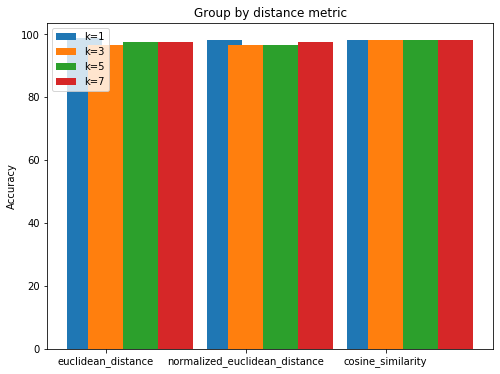
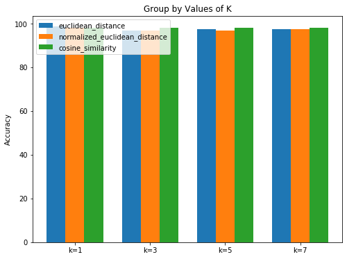

---
title: "DATA MINING : Assigment 02"
subtitle: "Implementing Knn for IRIS dataset "
summary: " In our case the optimal hyper-parameters we picked for this dataset using Knn is k=7 and cosine similarity metric, the accuracy equals to 98%"

authors:
- admin
tags: []
categories: []
date: "2020-04-02"
lastMod: ""
featured: false
draft: false

# Featured image
# To use, add an image named `featured.jpg/png` to your page's folder. 
image:
  caption: ""
  focal_point: ""
  
# Custom links (optional).
#  Uncomment and edit lines below to show custom links.
# links:
# - name: Follow
#   url: https://twitter.com
#   icon_pack: fab
#   icon: twitter

url_code: "https://github.com/AmnahAli/academic-kickstart/blob/master/content/post/assignment2/index.ipynb"
url_pdf: ""
url_slides: ""
url_video: ""


# Projects (optional).
#   Associate this post with one or more of your projects.
#   Simply enter your project's folder or file name without extension.
#   E.g. `projects = ["internal-project"]` references 
#   `content/project/deep-learning/index.md`.
#   Otherwise, set `projects = []`.
projects: []
---
#  Assignment #2  :
 The goal of this assignment is to learn about the kNN.    Implementation of kNN Algorithm using Python.


## (a) Divide the dataset as development and test. Make sure randomly divide the dataset.


```python
import pandas as pd
import numpy as np
import math
import collections
from collections import Counter
import matplotlib.pyplot as plt
from sklearn.utils import shuffle
```


```python
# import data IRIS dataset. https://archive.ics.uci.edu/ml/datasets/Iris 
iris = pd.read_csv("/Users/mamo/Downloads/Iris.csv")     #, header= None, index_col=False) 
iris.head()
```


<div>
<style scoped>
    .dataframe tbody tr th:only-of-type {
        vertical-align: middle;
    }

    .dataframe tbody tr th {
        vertical-align: top;
    }

    .dataframe thead th {
        text-align: right;
    }
</style>
<table border="1" class="dataframe">
  <thead>
    <tr style="text-align: right;">
      <th></th>
      <th>Sepal_Length</th>
      <th>Sepal_Width</th>
      <th>Petal_Length</th>
      <th>Petal_Width</th>
      <th>Type</th>
    </tr>
  </thead>
  <tbody>
    <tr>
      <td>0</td>
      <td>5.1</td>
      <td>3.5</td>
      <td>1.4</td>
      <td>0.2</td>
      <td>Iris-setosa</td>
    </tr>
    <tr>
      <td>1</td>
      <td>4.9</td>
      <td>3.0</td>
      <td>1.4</td>
      <td>0.2</td>
      <td>Iris-setosa</td>
    </tr>
    <tr>
      <td>2</td>
      <td>4.7</td>
      <td>3.2</td>
      <td>1.3</td>
      <td>0.2</td>
      <td>Iris-setosa</td>
    </tr>
    <tr>
      <td>3</td>
      <td>4.6</td>
      <td>3.1</td>
      <td>1.5</td>
      <td>0.2</td>
      <td>Iris-setosa</td>
    </tr>
    <tr>
      <td>4</td>
      <td>5.0</td>
      <td>3.6</td>
      <td>1.4</td>
      <td>0.2</td>
      <td>Iris-setosa</td>
    </tr>
  </tbody>
</table>
</div>


### To randomly divide the dataset 


```python
iris = shuffle(iris, random_state=0)
iris.head()
```


<div>
<style scoped>
    .dataframe tbody tr th:only-of-type {
        vertical-align: middle;
    }

    .dataframe tbody tr th {
        vertical-align: top;
    }

    .dataframe thead th {
        text-align: right;
    }
</style>
<table border="1" class="dataframe">
  <thead>
    <tr style="text-align: right;">
      <th></th>
      <th>Sepal_Length</th>
      <th>Sepal_Width</th>
      <th>Petal_Length</th>
      <th>Petal_Width</th>
      <th>Type</th>
    </tr>
  </thead>
  <tbody>
    <tr>
      <td>114</td>
      <td>5.8</td>
      <td>2.8</td>
      <td>5.1</td>
      <td>2.4</td>
      <td>Iris-virginica</td>
    </tr>
    <tr>
      <td>62</td>
      <td>6.0</td>
      <td>2.2</td>
      <td>4.0</td>
      <td>1.0</td>
      <td>Iris-versicolor</td>
    </tr>
    <tr>
      <td>33</td>
      <td>5.5</td>
      <td>4.2</td>
      <td>1.4</td>
      <td>0.2</td>
      <td>Iris-setosa</td>
    </tr>
    <tr>
      <td>107</td>
      <td>7.3</td>
      <td>2.9</td>
      <td>6.3</td>
      <td>1.8</td>
      <td>Iris-virginica</td>
    </tr>
    <tr>
      <td>7</td>
      <td>5.0</td>
      <td>3.4</td>
      <td>1.5</td>
      <td>0.2</td>
      <td>Iris-setosa</td>
    </tr>
  </tbody>
</table>
</div>


### Divide iris data to 112 points for development set and 38 points for test set  following the ratio 75:25


```python
iris_dev, iris_test= iris[:112], iris[112:]
```

## (b) implement kNN using the following hyper-parameters


## distance metric
* euclidean distance
* normalized euclidean distance
* cosine similarity


```python

def euclidean_distance(x, y):          # euclidean distance
    distance = 0.0
    for i in range(len(x)):
        distance += (x[i] - y[i])**2
    return np.sqrt(distance)


def normalized_euclidean_distance(x, y):   #normalized euclidean distance
    distance = 0.0
    for i in range(len(x)):
        avg = (x[i]-y[i])/2
        distance += ((x[i]-y[i])/np.sqrt( (x[i] - avg) ** 2 + (y[i] - avg) ** 2 ) ) ** 2
    return np.sqrt(distance)


def cosine_similarityi(x, y):       # cosine similarity
    dot =0.0
    sum_x =0.0
    sum_y =0.0 
    for i in range(len(x)):   
        dot += x[i]* y[i]
        sum_x += x[i]**2
        sum_y += y[i]**2
        cos = dot / (np.sqrt(sum_x) * np.sqrt(sum_y))
    return (1- cos)   

```


```python
# Knn using euclidean_distance 

def K_nearest_neighbor_E_D(predict, data, features, target, k):  
    row = data[features].apply(list,axis=1)                       # for each row convert data frame to a 4-dimensional point
    distances = row.apply(lambda x: euclidean_distance(predict,x)) # calculate distance for the point with each row
    neighbors = list(distances.sort_values()[:k].index)           # sort all the calculated distances, and take the the k-smallest distances 
    neighbors_votes = data.loc[neighbors, target]                 # indicate the take the the k-smallest distances class votes (labels)
    vote = collections.Counter(neighbors_votes).most_common()[0][0]  # take the votes from the k nearest neighbors  
    return vote                                                      # return (the most common) the first vote as the class label 


# Knn using normalized_euclidean_distance

def K_nearest_neighbor_N_E_D(predict, data, features, target, k):    
    row = data[features].apply(list,axis=1)                       
    distances = row.apply(lambda x: normalized_euclidean_distance(predict,x)) 
    neighbors = list(distances.sort_values()[:k].index)           
    neighbors_votes = data.loc[neighbors, target]                 
    vote = collections.Counter(neighbors_votes).most_common()[0][0]  
    return vote 


# Knn using cosine similarity

def K_nearest_neighbor_C_S(predict, data, features, target, k):    
    row = data[features].apply(list,axis=1)                       
    distances = row.apply(lambda x: cosine_similarityi(predict,x)) 
    neighbors = list(distances.sort_values()[:k].index)           
    neighbors_votes = data.loc[neighbors, target]                 
    vote = collections.Counter(neighbors_votes).most_common()[0][0]  
    return vote 
```

## number of neighbor K 
* 1,3,5,7


```python
k= [1,3,5,7] 
predict = [7.3, 2.9, 6.3, 1.8]
X = iris.columns[0:4]   #features  "Sepal_Length, Sepal_Width, Petal_Length, Petal_Width"
y = iris.columns[4]      #target  "Type"
```

## (c) Using the development dataset,
 * Calculate accuracy by iterating all of the development data point
* Find optimal hyperparameters
* * Draw bar charts for accuracy


```python
#iris_dev

# Knn using euclidean_distance 
def all_predictions_E_D(k):
    predictions = []                        
    for row in iris.itertuples(index=False):   # for each row in dataset iterate the values in a tuple
        dict_row = row._asdict()               
        xi = []
        for column in X.values:                                     
            xi.append(dict_row[column])                            # iterate through each feature
            result = K_nearest_neighbor_E_D(xi,iris_dev, X, y, k)  # predict each data point with the rest of the dataset 
        predictions.append(result)                                 # add the result to the prediction list
    return predictions


# Knn using normalized_euclidean_distance
def all_predictions_N_E_D(k):
    predictions = []                        
    for row in iris.itertuples(index=False):   
        dict_row = row._asdict()               
        xi = []
        for column in X.values:                
            xi.append(dict_row[column])     
            result = K_nearest_neighbor_N_E_D(xi,iris_dev, X, y, k)
        predictions.append(result)
    return predictions


# Knn using cosine similarity
def all_predictions_C_S(k):
    predictions = []                        
    for row in iris.itertuples(index=False):   
        dict_row = row._asdict()               
        xi = []
        for column in X.values:                
            xi.append(dict_row[column])     
            result = K_nearest_neighbor_C_S(xi,iris_dev, X, y, k)
        predictions.append(result)
    return predictions
```


```python
# Calculate the accuracy 

def accuracy_E_D(k):
    predictions = all_predictions_E_D(k)         
    correct = iris.loc[:,'Type'] == predictions   # count all the correct predictions by compare it with the actual label
    accuracy = (sum(correct)/len(predictions))*100
    return accuracy


print("euclidean_distance: \n") 

K1 = np.array([])
for i in range(len(k)): 
    print("k=",k[i],"\t",accuracy_E_D(k[i]) , "%")
    K1= np.append(K1, accuracy_E_D(k[i]))
print("\n")    
    
    
    
def accuracy_N_E_D(k):
    predictions = all_predictions_N_E_D(k)         
    correct = iris.loc[:,'Type'] == predictions   
    accuracy = (sum(correct)/len(predictions))*100
    return accuracy


print("normalized euclidean distance: \n") 

K2 =np.array([])
for i in range(len(k)): 
    print("k=",k[i],"\t",accuracy_N_E_D(k[i]) , "%") 
    K2= np.append(K2,accuracy_N_E_D(k[i]))
print("\n")    
    
    

    
def accuracy_C_S(k):
    predictions = all_predictions_C_S(k)         
    correct = iris.loc[:,'Type'] == predictions   
    accuracy = (sum(correct)/len(predictions))*100
    return accuracy


print("cosine similarity: \n") 

K3 =np.array([])
for i in range(len(k)): 
    print("k=",k[i],"\t",accuracy_C_S(k[i]) , "%") 
    K3= np.append(K3,accuracy_C_S(k[i]))
```

    euclidean_distance: 
    
    k= 1 	 98.66666666666667 %
    k= 3 	 96.66666666666667 %
    k= 5 	 97.33333333333334 %
    k= 7 	 97.33333333333334 %
    
    
    normalized euclidean distance: 
    
    k= 1 	 98.0 %
    k= 3 	 96.66666666666667 %
    k= 5 	 96.66666666666667 %
    k= 7 	 97.33333333333334 %
    
    
    cosine similarity: 
    
    k= 1 	 98.0 %
    k= 3 	 98.0 %
    k= 5 	 98.0 %
    k= 7 	 98.0 %


```python
import numpy as np
import matplotlib.pyplot as plt

labels = ['euclidean_distance', 'normalized_euclidean_distance', 'cosine_similarity']

k1=[K1[0],K2[0],K3[0]]
k3=[K1[1],K2[1],K3[1]]
k5=[K1[2],K2[2],K3[2]]
k7=[K1[3],K2[3],K3[3]]

data = [k1,k3,k5, k7]

X = np.arange(3)
fig = plt.figure(figsize=(8, 6))             
ax = plt.subplot(111)

ax.bar(X - 0.15, data[0], width = 0.25 ,label='k=1')
ax.bar(X + 0.00, data[1], width = 0.25 ,label='k=3')
ax.bar(X + 0.25, data[2], width = 0.25 ,label='k=5')
ax.bar(X + 0.50, data[3], width = 0.25 ,label='k=7')


ax.set_ylabel('Accuracy')
ax.set_title('Group by distance metric')
ax.set_xticks(X)
ax.set_xticklabels(labels)
ax.legend(loc="upper left")


```


    <matplotlib.legend.Legend at 0x11c391490>





```python
import numpy as np
import matplotlib.pyplot as plt


labels = ['k=1', 'k=3', 'k=5', 'k=7']

X = np.arange(4)
fig = plt.figure(figsize=(8, 6))           
ax = plt.subplot(111)
ax.bar(X - 0.25, K1, width = 0.25 ,label='euclidean_distance')
ax.bar(X + 0.00, K2, width = 0.25 ,label='normalized_euclidean_distance')
ax.bar(X + 0.25, K3, width = 0.25 ,label='cosine_similarity')


ax.set_ylabel('Accuracy')
ax.set_title('Group by Values of K')
ax.set_xticks(X)
ax.set_xticklabels(labels)
ax.legend(loc="upper left")


```


    <matplotlib.legend.Legend at 0x11c55de50>





## (d) Using the test dataset
* Use the optimal hyper-parameters you found in the step c, and use it to calculate the final accuracy.  


### In our case the optimal hyper-parameters we picked for this dataset using Knn is k=7 and cosine similarity metric with accuracy equal to 98%


```python
k= 7
K_nearest_neighbor_C_S(predict,iris_test, X, y, k)
all_predictions_C_S(k)
final_accuracy = accuracy_C_S(k)
print("test accuracy:", final_accuracy)
```

    test accuracy: 98.0


This dataset with multiple hyper-paramters give a very similar accuracy in this case we picked the value of k= 7 which gave us accuracy = 97% using euclidean_distance and normalized euclidean distance and 98% using cosine. 
Also we picked cosine similarity. 

 References: 
  *  * arxiv.org/pdf/1708.04321.pdf
  *  * www.kaggle.com/ptdrow/k-nearest-neighbors-classifier-from-scratch/data
  *  * www.youtube.com/watch?v=GWHG3cS2PKc
