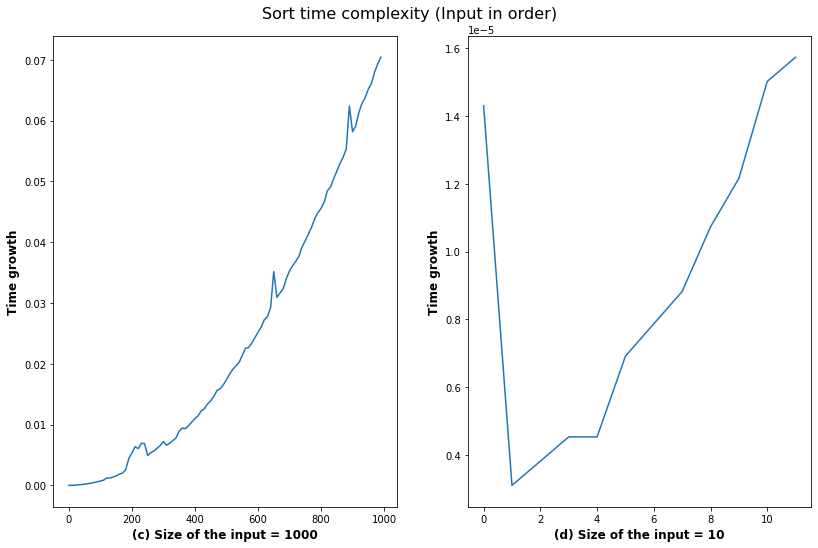

Amnah Abdelrahman
1001772588

# CSE-5311 Project 

(Design and Analysis ofAlgorithms)
This project is a demonstration of a set of sorting algorithms. For each algorithm, there is an introduction, explanation of the code component, the running time complexity, when the algorithm is suitable to use, and improvement suggestions. After that, there will be the code itself followed by graphs representation and result discussion.

## Content :

* [Selection_sort](#Selection_sort)
* [Insrtion_sort](#Insertion_sort)
* [Quick_sort](#Quick_sort)
    * Regular quick sort, [Quick_sort](#Quick_sort)
    * quick sort using 3 medians, [Quick_sort3](#Quick_sort3)
* [Merge_sort](#Merge_sort)
* [Bubble_sort](#Bubble_sort)
* [Heap_sort](#Heap_sort)

Next is the implamntaion for each sorting method.


```python
import sys 
sys.setrecursionlimit(15000)   #10**6)     #Handling recursion limit

import time
import numpy as np

import random
from random import randint
from numpy.random import randn

import matplotlib.pyplot as plt
%matplotlib inline
```


```python
import matplotlib.pyplot as plt
%matplotlib inline

def graph_random(name_algorith):   
    N = [randint(0,1000) for i in range(1000) ]   #[i for i in range(5000)]
    x = [i for i in range(0,1000,10)]
    times = []

    for i in range(0,1000,10):
        start_time = time.time()
        name_algorith(N[:i])
        pass_time = time.time() - start_time
        times.append(pass_time)


    N1 = [randint(0,12) for i in range(20) ]   #[i for i in range(5000)]
    x1 = [i for i in range(0,12,1)]
    times1 = []

    for i in range(0,12,1):
        start_time1 = time.time()
        name_algorith(N1[:i])
        pass_time1 = time.time() - start_time1
        times1.append(pass_time1)    


    plt.figure(figsize=(12, 8))  
    plt.subplot(121)
    plt.plot(x,times) 
    plt.xlabel("(a) Size of the input = 1000",fontsize='large', fontweight='bold')
    plt.ylabel("Time growth",fontsize='large', fontweight='bold')


    plt.subplot(122)
    plt.plot(x1,times1)
    plt.xlabel("(b) Size of the input = 10",fontsize='large', fontweight='bold')
    plt.ylabel("Time growth",fontsize='large', fontweight='bold')

    plt.tight_layout(pad=3.0)
    plt.suptitle('Sort time complexity (Input in random)', fontsize=16)

    plt.show()
    
    
    
def graph_sored(name_algorith):   
    N = [i for i in range(1000)]  # [randint(0,1000) for i in range(1000) ]   #[i for i in range(5000)]
    x = [i for i in range(0,1000,10)]
    times = []

    for i in range(0,1000,10):
        start_time = time.time()
        name_algorith(N[:i])
        pass_time = time.time() - start_time
        times.append(pass_time)


    N1 = [i for i in range(12) ]   #[i for i in range(5000)]
    x1 = [i for i in range(0,12,1)]
    times1 = []

    for i in range(0,12,1):
        start_time1 = time.time()
        name_algorith(N1[:i])
        pass_time1 = time.time() - start_time1
        times1.append(pass_time1)    


    plt.figure(figsize=(12, 8))  
    plt.subplot(121)
    plt.plot(x,times) 
    plt.xlabel("(c) Size of the input = 1000",fontsize='large', fontweight='bold')
    plt.ylabel("Time growth",fontsize='large', fontweight='bold')


    plt.subplot(122)
    plt.plot(x1,times1)
    plt.xlabel("(d) Size of the input = 10",fontsize='large', fontweight='bold')
    plt.ylabel("Time growth",fontsize='large', fontweight='bold')

    plt.tight_layout(pad=3.0)
    plt.suptitle('Sort time complexity (Input in order)', fontsize=16)

    plt.show()  
    
    
    
    
    
def graph_reveres(name_algorith):   
    
    N = [i for i in range(1000)]   #[i for i in range(5000)]
    N = N[::-1]
    x = [i for i in range(0,1000,10)]
    times = []

    for i in range(0,1000,10):
        start_time = time.time()
        name_algorith(N[:i])
        pass_time = time.time() - start_time
        times.append(pass_time)


    N1 = [i for i in range(12) ]    #[i for i in range(5000)]
    N1 = N1[::-1]
    x1 = [i for i in range(0,12,1)]
    times1 = []

    for i in range(0,12,1):
        start_time1 = time.time()
        name_algorith(N1[:i])
        pass_time1 = time.time() - start_time1
        times1.append(pass_time1)    


    plt.figure(figsize=(12, 8))  
    plt.subplot(121)
    plt.plot(x,times) 
    plt.xlabel("(e) Size of the input = 1000",fontsize='large', fontweight='bold')
    plt.ylabel("Time growth",fontsize='large', fontweight='bold')


    plt.subplot(122)
    plt.plot(x1,times1)
    plt.xlabel("(f) Size of the input = 10",fontsize='large', fontweight='bold')
    plt.ylabel("Time growth",fontsize='large', fontweight='bold')

    plt.tight_layout(pad=3.0)
    plt.suptitle('Sort time complexity (Input in reverse order)', fontsize=16)

    plt.show()    
    
    
    
    
def graph_random_quick(name_algorith):   
    N = [randint(0,1000) for i in range(1000) ]   #[i for i in range(5000)]
    x = [i for i in range(0,1000,10)]
    times = []

    for i in range(0,1000,10):
        start_time = time.time()
        name_algorith(N[:i],0, len(N[:i])-1) 
        pass_time = time.time() - start_time
        times.append(pass_time)


    N1 = [randint(0,12) for i in range(20) ]   #[i for i in range(5000)]
    x1 = [i for i in range(0,12,1)]
    times1 = []

    for i in range(0,12,1):
        start_time1 = time.time()
        name_algorith(N1[:i],0, len(N1[:i])-1) 
        pass_time1 = time.time() - start_time1
        times1.append(pass_time1)    


    plt.figure(figsize=(12, 8))  
    plt.subplot(121)
    plt.plot(x,times) 
    plt.xlabel("(a) Size of the input = 1000",fontsize='large', fontweight='bold')
    plt.ylabel("Time growth",fontsize='large', fontweight='bold')


    plt.subplot(122)
    plt.plot(x1,times1)
    plt.xlabel("(b) Size of the input = 10",fontsize='large', fontweight='bold')
    plt.ylabel("Time growth",fontsize='large', fontweight='bold')

    plt.tight_layout(pad=3.0)
    plt.suptitle('Sort time complexity (Input in random)', fontsize=16)

    plt.show()
    
    
    
def graph_sored_quick(name_algorith):   
    N = [i for i in range(1000)]  # [randint(0,1000) for i in range(1000) ]   #[i for i in range(5000)]
    x = [i for i in range(0,1000,10)]
    times = []

    for i in range(0,1000,10):
        start_time = time.time()
        name_algorith(N[:i],0, len(N[:i])-1)      #(N, 0, len(N)-1)
        pass_time = time.time() - start_time
        times.append(pass_time)


    N1 = [i for i in range(12) ]   #[i for i in range(5000)]
    x1 = [i for i in range(0,12,1)]
    times1 = []

    for i in range(0,12,1):
        start_time1 = time.time()
        name_algorith(N1[:i],0, len(N1[:i])-1)
        pass_time1 = time.time() - start_time1
        times1.append(pass_time1)    


    plt.figure(figsize=(12, 8))  
    plt.subplot(121)
    plt.plot(x,times) 
    plt.xlabel("(c) Size of the input = 1000",fontsize='large', fontweight='bold')
    plt.ylabel("Time growth",fontsize='large', fontweight='bold')


    plt.subplot(122)
    plt.plot(x1,times1)
    plt.xlabel("(d) Size of the input = 10",fontsize='large', fontweight='bold')
    plt.ylabel("Time growth",fontsize='large', fontweight='bold')

    plt.tight_layout(pad=3.0)
    plt.suptitle('Sort time complexity (Input in order)', fontsize=16)

    plt.show()      
```

<a id="Selection_sort"></a>

# <span style='color:blue'>  Selection Sort </span>

### Intorduction:
Selection sort considered one of the simplest sorting algorithms. It works by selecting the smallest item in the array and places it in the first position (means replace it with the current element in the first position). Then find the next smallest item and exchange it with the second position and continue until the array is sorted. The leftmost part of the array is the sorted part, it is keeps growing until all array elements are all sorted. 

### code components:
The algorithm is easy to implement and understand, it relies on one function consists of a nested loop. The outer-loop is to move the position of the current element of the array and loop through all the array positions. The inner-loop is to test the current element against the rest of the next elements in the array.


### Running time complexity:
For an array with size n, the running time is based on the number of compares, which is (n^2)(Quadratic growth), also knowing that the number of swap or exchange is n (linear growth). The number of swaps never exceeds n times so this algorithm is insensitive to the size of the array (the input). Because of that the outer with the inner loop has a running time complexity of O(n^2) in all cases (best, average, and worst case). In more detail the outer loop iterate n times, and the inner loop goes as (n-1) when i equals one then (n-2) when i equals 2 till it becomes (1) when i is n. In general the time complexity of Selectoin Sort is O(n2) as there are two nested loops (in all worst, average and best cases)

### Space complity:
Selection sort is in-place algorithm it does not requir additional memory, the space complexity is O(1).
    
### Usage:
The algorithm is stable for small array sizes. The good thing about the selection algorithm is that the number of exchanges is a linear function and it never exceeds the O(n) amount of time. The disadvantage is even if the array is sorted it will take n^2 running time. Besides, it does not take advantage of the initial order of the input.

### Improvment:
Heap sort is an improvment of selection algorithm, it has 0(n log n) running time complexity. 


```python
def selection_sort(A):               # sort array A in to increasing order
    for i in range(len(A)-1):        # the outer-loop starting from left to right, to check for each element  
                                     #of the array with the rest of the array elements until the whole array is sorted, 
                                     #note that the index (size-1) is the last item is going to be in its correct position
        minimum = i
        for j in range(i+1,len(A)):  # inner loop starts from the second element until the last element of the array
            if A[j] < A[minimum]:    # compere to test the current elemment aganist the smallest element found
                minimum = j          # if current element larger then exhange the indexes  
                     
        A[minimum] , A[i] = A[i] , A[minimum]   # swap A[i] & A[minimum] positions, 
                                                # the A[minimum] will be in its final position
                
    return A                         # return the sorted array A 
```

### implementation of selection_sort: 


```python
# Size of N is 6
N = [90,91,6, 0, 3, 120]
func1_time = []
print("Size of the array:", len(N), "\n")
print("The sorted array:", selection_sort(N),"\n")  
print( "Return the execution time taken: ")
%timeit -o selection_sort(N)
func1= _
print("\n")
print ("Return the size of the array in bytes: ",sys.getsizeof(N))
```

    Size of the array: 6 
    
    The sorted array: [0, 3, 6, 90, 91, 120] 
    
    Return the execution time taken: 
    100000 loops, best of 3: 3.12 µs per loop
    
    
    Return the size of the array in bytes:  112


```python
# Size of N is 30
N = [-56,-1,0.5,8,12,6,2,7,9,0,1,4,5,6,0,81,91,90,90,91,6, 1.01, 3, 120, 7,300, 69, 54,33,201, 309,100,
    77,44,99,3,8,2,8,0,5,1,4,0,99,123,5657,979,6544,987,2344,87,1,4,.65,3.111,666, .25, 1000,53]

print("Size of the array:", len(N), "\n")
start_time = time.time()
print("The sorted array:", selection_sort(N),"\n") 
elapsed_time = time.time() - start_time
print( "Return the execution time taken: ")
%timeit selection_sort(N)
print("\n")
print ("Return the size of the array in bytes: ",sys.getsizeof(N))
```

    Size of the array: 60 
    
    The sorted array: [-56, -1, 0, 0, 0, 0, 0.25, 0.5, 0.65, 1, 1, 1, 1.01, 2, 2, 3, 3, 3.111, 4, 4, 4, 5, 5, 6, 6, 6, 7, 7, 8, 8, 8, 9, 12, 33, 44, 53, 54, 69, 77, 81, 87, 90, 90, 91, 91, 99, 99, 100, 120, 123, 201, 300, 309, 666, 979, 987, 1000, 2344, 5657, 6544] 
    
    Return the execution time taken: 
    10000 loops, best of 3: 133 µs per loop
    
    
    Return the size of the array in bytes:  544


```python
graph_random(selection_sort)  # Test the alogrothim when the input is randomized (unsorted)
graph_sored(selection_sort)   # Test the alogrothim when the input is inorder (sorted)
```


### Expremintal result:

* We can see from the graphs, the running time comlexty when size of N is getting bigger moved form approximatly (c) (1.0013580322265625e-05 µs) to (d) (0.057395219802856445 µs)
* There is no hugh different in the algorithm performance when the input array is sorted and unsorted.
* graph (a) and (c) have a close running time that same as (b) & (d)


    

<a id="Insertion_sort"></a>

# <span style='color:blue'>  Insertion sort </span>

### Intorduction:
The idea of the insertion sort is to insert the current element to its correct position after creating space, by moving the lager items one position to the right. The array is considered sorted after the index stoped at the right end of the array. 

### code components:
The code is straightforward, it has two nested loops, the outer-loop to examine each item in the array, the inner-loop is to make a room for the smaller item to be inserted in its right position, by moving the largest items one position to the right. 

    
### Running time complexity:
The running time complexity is based on the number of compares and swaps, knowing that the insertion sort algorithm is sensitive to the size of the input. The best running time is when the array is already sorted (linear running time). The worst running time is when the array is sorted in reverse order (quadratic growth), all items need to go back. Nonetheless, the average case expects that each item might need to move halfway back.


### Space complity:
Inseration sort is in-place algorithm it does not requir additional memory, the space complexity is O(1).
    
### Usage:
The algorithm works well for the nearly sorted array despite its size or in an array where each entry is not far from it is the right position, so the number of inversions is low.

### Improvment:
Insertion sort could be improved with a shorter inner loop, moving the large element one position to the right rather than moving it all-the-way to the end. In other words by dividing the array to sub-arrays and run the algorithm in each segment.


```python
def insertion_sort(A):               # sort array A in to increasing order
    for i in range(len(A)):          # the outer-loop starting from the left to right examing each item in the array with the left item
        key = A[i]                   # set the current item as the key 
        j =i-1                       # now starting the inner loop from  most left index
        while(j>=0 and key < A[j]):  # check the key item with its left nieghbour if it is larger keep the loop
            A[j+1] = A[j]            # to make a space move the current item one postion to the right.
            j-=1                     # reduce the index of the inner loop 
        A[j+1] = key                 # now after making a room, move the key to it is right position. 
    return A                         # return the sorted array A 
```


```python
N = [90,91,6, 0, 3, 120]
print(insertion_sort(N))  
print( "Time Complexity: ")
%timeit insertion_sort(N)
print ("Space Complexity: ",sys.getsizeof(N))
```

    [0, 3, 6, 90, 91, 120]
    Time Complexity: 
    The slowest run took 4.83 times longer than the fastest. This could mean that an intermediate result is being cached.
    1000000 loops, best of 3: 1.17 µs per loop
    Space Complexity:  112


```python
# Size of N is 30
N = [-56,-1,0.5,8,12,6,2,7,9,0,1,4,5,6,0,81,91,90,90,91,6, 1.01, 3, 120, 7,300, 69, 54,33,201, 309,100,
    77,44,99,3,8,2,8,0,5,1,4,0,99,123,5657,979,6544,987,2344,87,1,4,.65,3.111,666, .25, 1000,53]
print(insertion_sort(N))  
print( "Time Complexity: ")
%timeit insertion_sort(N)
print ("Space Complexity: ",sys.getsizeof(N))
```

    [-56, -1, 0, 0, 0, 0, 0.25, 0.5, 0.65, 1, 1, 1, 1.01, 2, 2, 3, 3, 3.111, 4, 4, 4, 5, 5, 6, 6, 6, 7, 7, 8, 8, 8, 9, 12, 33, 44, 53, 54, 69, 77, 81, 87, 90, 90, 91, 91, 99, 99, 100, 120, 123, 201, 300, 309, 666, 979, 987, 1000, 2344, 5657, 6544]
    Time Complexity: 
    100000 loops, best of 3: 9.14 µs per loop
    Space Complexity:  544


```python
graph_random(insertion_sort) # Test the alogrothim when the input is randomized (unsorted)
graph_sored(insertion_sort)  # Test the alogrothim when the input is inorder (sorted)
graph_reveres(insertion_sort) # Test the alogrothim when the input is in reverse order
```


### Expremintal result:
* From the graphs we can see that the algorithm is doing poorly when the input is highly unsorted (random) and much better when the array is sorted. 
* The running time changed dramatically when the size of the input increases and it grows gradually in a quadratic manner. 


```python

```

<a id="Merge_sort"></a>

# <span style='color:blue'>  Merge sort </span>

### Intorduction:
Merge sort is a divide-and-conqure algorithm design paradigm. It divides the array into two halves, sorting them recursively then merge the results. 


### code components:
The code required two functions: merge and merge_sort. The function merge_sort is dividing the array into two
halves by splitting around the middle point (position), then repeat that recursively for each half, continue like that until each subarray has one element. 
The function merge used an auxiliary array to mere the sorted elements from each half, then return the sorted array.
   
    
### Running time complexity:
The running time complexity is guaranteed to sort an array of size n in (n log n time). Therefore the running time complexity is O(n log n) for all the cases. It takes (log n) to divide the array and (n) to merge all sub-arrays into a single array.
The maximum number of division (k) when each sub-array has one element n/2^k = 1, by taking the log base of (2) for each side we get k = log n.

### Space complity:
Merge sort is out-of-place algorithm it requirs and third array to merge the sub-arrays into one sorted array, O(n).
    
### Usage:
Merge sort used in many apliactions it is applicable for external sorting.

### Improvment:
Use the insertion sort for the small subarray list where it could be faster in this case. Another suggestion is 
check if the array is already ordered to avoid calling merge.


```python
def merge(L , R):           # merge the two halves the left and right into one array 
    C = []                  # intilize an auxiliary array to merge and hold the sorted array 
    i = j = 0               # intiliz the counter for each array the left and right one. 
    k = len(L) + len(R) 
    
    while len(C) < k:       # while the length of the auxiliary array less the the length of the compound size 
        if L[i] > R[j]:     # check if the element of the right array is smaller 
            C.append(R[j])  # if yes append the element into the auxiliary array C
            #B.remove(B[j]) 
            j+=1            # increment the count for the right array 
        else:
            C.append(L[i])  # if the element in the left array is smaller then append the elements to C
            #A.remove(A[i])
            i+=1            # and increament the counter for the left array        
            
        if i == len(L):    # now check if any element was remain and simply extend it to the C 
            C += R[j:]
   
          
        if j == len(R): 
            C += L[i:]

            
    return C               # Return the merged sorted array 
            
            
def merge_sort(A):         # sort array A in to increasing order
    if len(A)==1:          # check if the array have only one element then just return A 
        return A 
    else:                  
        mid = len(A)//2    # else  calculate the middle index of A
        L = A[:mid]        # divide A into two halves left from the first element to the middle  
        R = A[mid:]        # and right half form the middle to the end 
    return merge(merge_sort(L), merge_sort(R))     # call the merge function for each halves and sort them recursively        
```


```python
# Size of N is 6
N = [90,91,6, 0, 3, 120]
print(merge_sort(N))  
print( "Time Complexity: ")
%timeit merge_sort(N)
print ("Space Complexity: ",sys.getsizeof(N))
```

    [0, 3, 6, 90, 91, 120]
    Time Complexity: 
    100000 loops, best of 3: 8.72 µs per loop
    Space Complexity:  112


```python
# Size of N is 30
N = [-56,-1,0.5,8,12,6,2,7,9,0,1,4,5,6,0,81,91,90,90,91,6, 1.01, 3, 120, 7,300, 69, 54,33,201, 309,100,
    77,44,99,3,8,2,8,0,5,1,4,0,99,123,5657,979,6544,987,2344,87,1,4,.65,3.111,666, .25, 1000,53]
print(merge_sort(N))  
print( "Time Complexity: ")
%timeit merge_sort(N)
print ("Space Complexity: ",sys.getsizeof(N))
```

    [-56, -1, 0, 0, 0, 0, 0.25, 0.5, 0.65, 1, 1, 1, 1.01, 2, 2, 3, 3, 3.111, 4, 4, 4, 5, 5, 6, 6, 6, 7, 7, 8, 8, 8, 9, 12, 33, 44, 53, 54, 69, 77, 81, 87, 90, 90, 91, 91, 99, 99, 100, 120, 123, 201, 300, 309, 666, 979, 987, 1000, 2344, 5657, 6544]
    Time Complexity: 
    10000 loops, best of 3: 156 µs per loop
    Space Complexity:  544


```python
# maximum recursion depth exceeded in comparison issue
# graph_random(merge_sort) # Test the alogrothim when the input is randomized (unsorted)
# graph_sored(merge_sort)  # Test the alogrothim when the input is inorder (sorted)
```

### Expremintal result:
From the above example the execution time difference when the size of N is 6 (100000 loops, best of 3: 7.48 µs per loop) compared to N = 30 (10000 loops, best of 3: 135 µs per loop) is noticable. The same example compared to insertion_sort, insertion_sort is faster for this small size of array.

<a id="Quick_sort"></a>

# <span style='color:blue'>  Quicksort (Regular quick sort) </span>

### Intorduction:
Quicksort is a divide-and-conquer method. It is a popular algorithm and easy to implement. The main idea that it is working by select an item as a pivot then partition the array into two subarrays on the left all the elements are smaller than the pivot, and on the right, all the elements are larger than the pivot.. 

### code components:
The code is divided into two functions partition and quik_sort. The second function, divided the array into two subarrays around the pivot, then recursively applying the same method then return the sorted array. The pivot is an arbitrary choice to be the partitioning item, it can be the first, the last or any item. The left subarray has all elements less than the pivot, and the right subarray has all the elements greater than the pivot.  This last arrangement was done by the partition function. The method runs two counters, one of them starts at -1, and the other at 0, then check for all the elements that are less than the pivot, at the end of the loop, it places the pivot to its correct position. 

    
### Running time complexity:
On average, for an array with size n, quicksort uses (n log n) compares. The best case when the pivot is the median and the array partitioned into exactly two halves it also takes O(n log n). The worst-case has a quadratic performance, is happens when using the wrong pivot (when it is the smallest or the largest element in the array in every recursion).  

### Space complity:
Quick sort is in-place algorithm it does not requir auxiliary memory, the space complexity is O(1).
    
### Usage:
The algorithm works well for a variety of applications, it is not difficult to implement and faster than many other sorting algorithms on the average case. 
### Improvment:
Some work was done to avoid the worst-case scenario, by shuffling the array to avoid the bad partitions around the smallest or largest pivot in every stage. The next algorithm the 3-way sort is also considered an improvement for the 2-way sorting. 


```python
def partition(A,low,high):          # partition the array into two sub-arrays 
    i = low - 1                     # set the index for the smaller element
    pivot = A[high]                 # choose the last element as the pivot,   
                                    # the goal is to place the pivot in its right palce 
    for j in range(low , high):     # for each element in the array  
        if   A[j] <= pivot:         # check if the current value smaller than the pivot, 
            i +=1                   # increament the index for the smaller element  
            A[i],A[j] = A[j],A[i]   # and do a swap between A[i] & A[j]
  
    A[i+1],A[high] = A[high],A[i+1] # swap the pivot with the A[i+1] to its correct position
    return  i+1                     # return the correct piovt index


def quickSort(A,low,high):       # sort array A in to increasing order 
    if low > high:  return                 
    pi = partition(A,low,high)   # pi (pivot) in it is correct position and call the partition function. 
    quickSort(A, low, pi-1)      # recusilvy reparte the method for the left subarray 
    quickSort(A, pi+1, high)     # recusilvy reparte the method for the right subarray  
    return A                     # return the sorted array 
```


```python
# Size of N is 6
N = [90,91,6, 0, 3, 120]
print(quickSort(N, 0, len(N)-1))  
print( "Time Complexity: ")
%timeit quickSort(N,0,len(N)-1)
print ("Space Complexity: ",sys.getsizeof(N))
```

    [0, 3, 6, 90, 91, 120]
    Time Complexity: 
    100000 loops, best of 3: 6.33 µs per loop
    Space Complexity:  112


```python
# Size of N is 30
N = [-56,-1,0.5,8,12,6,2,7,9,0,1,4,5,6,0,81,91,90,90,91,6, 1.01, 3, 120, 7,300, 69, 54,33,201, 309,100,
    77,44,99,3,8,2,8,0,5,1,4,0,99,123,5657,979,6544,987,2344,87,1,4,.65,3.111,666, .25, 1000,53]
print(quickSort(N, 0, len(N)-1))  
print( "Time Complexity: ")
%timeit quickSort(N, 0, len(N)-1)
print ("Space Complexity: ",sys.getsizeof(N))
```

    [-56, -1, 0, 0, 0, 0, 0.25, 0.5, 0.65, 1, 1, 1, 1.01, 2, 2, 3, 3, 3.111, 4, 4, 4, 5, 5, 6, 6, 6, 7, 7, 8, 8, 8, 9, 12, 33, 44, 53, 54, 69, 77, 81, 87, 90, 90, 91, 91, 99, 99, 100, 120, 123, 201, 300, 309, 666, 979, 987, 1000, 2344, 5657, 6544]
    Time Complexity: 
    1000 loops, best of 3: 281 µs per loop
    Space Complexity:  544


```python
graph_random_quick(quickSort) # Test the alogrothim when the input is randomized (unsorted)
graph_sored_quick(quickSort)  # Test the alogrothim when the input is inorder (sorted)
```





### Expremintal result:
From the graphs, we can see that when the array in-order the performance has a quadratic growth, it increases gradually. However, in our case, we picked the last element to be the pivot which makes the code perform wors. As well as when the size of the array increases it takes a very long time to execute.    


```python

```

<a id="Merge_sort3"></a>

# <span style='color:blue'>  quick sort using 3 medians </span>

### Intorduction:
Quicksort is a divide-and-conquer method for sorting. In this method, we divide the array into three subarrays. One for the elements smaller than the pivot, one for the elements equal to the pivot and one for the elements greater than the pivot.    

### code components:
The code is similar to the 2 way Quick-sort approach. The different is we choose the median of three randomly chosen elements as the pivot. It is divided into two functions. First, a function to divide the array into three subarrays around the pivot, then works recursively. Again the pivot is an arbitrary choice. The subarray is the left one with all the elements less than the pivot, and the right subarray has all the elements greater than the pivot, and the middle one for the elements equal to the pivot. 
    
    
### Running time complexity:
On average, for an array with size n, quick sort use (n log n) compares also for the best case when the subarrays are balanced. So this improved algorithm could avoid the worst-case scenario O(n^2) by using the median and reduce the size of the subarrays. 

### Space complity:
Quick sort is in-place algorithm it does not requir additional memory, the space complexity is O(1).
    
### Usage:
The algorithm works well for a variety of applications, it is not difficult to implement and faster than many other sorting algorithms.  

### Improvment:
This algorthim is an imporvment for the Regular quick sort.


```python
import random 

def partition3(A, low, high):

    i = low                           # the counter for all elemnt less than pivot
    k = low                           # We scan the array from left to right
    j = high                          # the counter for all elemnt greater than pivot
    pivot = A[low]                    # choose the last element as the pivot
    while k <= j:      
        if A[k] < pivot:              # if the current element less than the pivot 
            A[i], A[k] = A[k], A[i]   # plac the current elemnt with the smaller elemnts  
            i += 1                    # incrment the counter for the next element
        
        elif A[k] > pivot:            # if the current element greater than the pivot 
            A[k], A[j] = A[j], A[k]   # plac the current elemnt with the greater elemnts 
            j -= 1                    # deincremnt the counter for the pervious element
        else:
            k += 1                    # the value of the current equal to the pivot 
            
    return i, j                       # return the index of patitions for less and greater elemnts


def quick_sort_3way(A, low, high):

    if low > high:  return 
    i, j = partition3(A, low, high)   # i and j in thier correct position and call the partition function. 
    quick_sort_3way(A, low, i - 1)         # recusilvy reparte the method 
    quick_sort_3way(A, j + 1, high)        # recusilvy reparte the method 
    return A                          # return the sorted array


```


```python
# Size of N is 6
N = [90,91,6, 0, 3, 120]
print(quick_sort_3way(N, 0, len(N)-1))  
print( "Time Complexity: ")
%timeit quick_sort_3way(N,0,len(N)-1)
print ("Space Complexity: ",sys.getsizeof(N))
```

    [0, 3, 6, 90, 91, 120]
    Time Complexity: 
    100000 loops, best of 3: 5.87 µs per loop
    Space Complexity:  112


```python
# Size of N is 30
N = [-56,-1,0.5,8,12,6,2,7,9,0,1,4,5,6,0,81,91,90,90,91,6, 1.01, 3, 120, 7,300, 69, 54,33,201, 309,100,
    77,44,99,3,8,2,8,0,5,1,4,0,99,123,5657,979,6544,987,2344,87,1,4,.65,3.111,666, .25, 1000,53]
print(quick_sort_3way(N, 0, len(N)-1))  
print( "Time Complexity: ")
%timeit quick_sort_3way(N, 0, len(N)-1)
print ("Space Complexity: ",sys.getsizeof(N))
```

    [-56, -1, 0, 0, 0, 0, 0.25, 0.5, 0.65, 1, 1, 1, 1.01, 2, 2, 3, 3, 3.111, 4, 4, 4, 5, 5, 6, 6, 6, 7, 7, 8, 8, 8, 9, 12, 33, 44, 53, 54, 69, 77, 81, 87, 90, 90, 91, 91, 99, 99, 100, 120, 123, 201, 300, 309, 666, 979, 987, 1000, 2344, 5657, 6544]
    Time Complexity: 
    10000 loops, best of 3: 121 µs per loop
    Space Complexity:  544


```python
graph_random_quick(quick_sort_3way) # Test the alogrothim when the input is randomized (unsorted)
graph_sored_quick(quick_sort_3way)  # Test the alogrothim when the input is inorder (sorted)
```


### Expremintal result:
Based on these graphs and the graphs for the regular quicksort when we can see this one required less amount of time for the same input size. 


```python

```

<a id="Bubble_sort"></a>

# <span style='color:blue'>  Bubble sort </span>

### Intorduction:
Bubble sort is a simple algorithm, for each adjacent pair of elements check their values and exchange to sort them. 

### code components:
The code is simply running two counters for a pair of adjacent elements (i,j) then check the value of (A[i], A[j]) and swap them if they are not in order. 
 
    
### Running time complexity:
The running time complexity is O(n^2) in the average and worst-case when the array in reversed order, the best case when the array is in order and no swap needs to made in this case the run-time complexity is linear O(n). 


### Space complity:
It is in-place algorithm, the space complexity is O(1).
    
    
### Usage:
Mainly it is mentioned for educational applications. Bubble sort is suitable for short arrays, it works very poorly for a large array because it will require a large number of swaps. The main application of bubble sort is in computer graphics where it is sensitive to a very small error.

### Improvment:
Ways to improve the performance of bubble sort is using a flag for the next iteration to check if there is no swap were made during the previous iteration, which means the elements in order and the loop should stop. This optimization could make a difference for huge arrays. The other 
the thing that can be done is to run the kth pass in the outer loop for only the first n+k-1 in the inner loop, where the rest will be already sorted.


```python
def bubble_sort(A):                            # sort array A in to increasing order
    for i in range(len(A)):                    # The outer loop & The inner loop to check  
        for j in range (len(A)-1):             # for each elements in the array
            if A[j]>A[j+1]:                    # compare each pair of adjacent elemnt 
                A[j], A[j+1] = A[j+1],  A[j]   # if they are not in order swap them
    return A                                   # return the sorted array 
```


```python
# Size of N is 6
N = [90,91,6, 0, 3, 120]
print(bubble_sort(N))  
print( "Time Complexity: ")
%timeit bubble_sort(N)
print ("Space Complexity: ",sys.getsizeof(N))
```

    [0, 3, 6, 90, 91, 120]
    Time Complexity: 
    100000 loops, best of 3: 4.12 µs per loop
    Space Complexity:  112


```python
# Size of N is 30
N = [-56,-1,0.5,8,12,6,2,7,9,0,1,4,5,6,0,81,91,90,90,91,6, 1.01, 3, 120, 7,300, 69, 54,33,201, 309,100,
    77,44,99,3,8,2,8,0,5,1,4,0,99,123,5657,979,6544,987,2344,87,1,4,.65,3.111,666, .25, 1000,53]
print(bubble_sort(N))  
print( "Time Complexity: ")
%timeit bubble_sort(N)
print ("Space Complexity: ",sys.getsizeof(N))
```

    [-56, -1, 0, 0, 0, 0, 0.25, 0.5, 0.65, 1, 1, 1, 1.01, 2, 2, 3, 3, 3.111, 4, 4, 4, 5, 5, 6, 6, 6, 7, 7, 8, 8, 8, 9, 12, 33, 44, 53, 54, 69, 77, 81, 87, 90, 90, 91, 91, 99, 99, 100, 120, 123, 201, 300, 309, 666, 979, 987, 1000, 2344, 5657, 6544]
    Time Complexity: 
    1000 loops, best of 3: 275 µs per loop
    Space Complexity:  544


```python
graph_random(bubble_sort) # Test the alogrothim when the input is randomized (unsorted)
graph_sored(bubble_sort)  # Test the alogrothim when the input is inorder (sorted)
graph_reveres(bubble_sort)# Test the alogrothim when the input is in reverse order (reveresed)
```


### Expremintal result:
We can see that the algorithm has O(n^2) for the worst case, in (e) & (f) the algorithm takes much more time to execute. Then when the array is sorted it takes about half of the running time compared to when it is randomized. 


```python

```

<a id="Heap_sort"></a>

# <span style='color:blue'>  Heapsort </span>

### Intorduction:
Heapsort can be an improvement for the selection sort algorithm. It does not use the scan to go over elements to find the largest/smallest element, it uses a heap structure to extract the largest/smallest element without wasting time. But, it has the same approach of splitting the array to sorted and unsorted part then recursively keeps shrinking the unsorted part until the array is sorted. 
 

### code components:
A heap is a complete balanced binary tree where each parent is (larger/smaller) than it is children called (max-heap/ min-heap).
Heap sort algorithm is broken into three steps (or mainly two phases): build the heap by transforming the array into a heap, then take the highest priority item out of the heap each time. This operation of pulling the highest priority item in each iteration will form a sorted array, but during this second stage the heap needs to be maintained, the operation of fixing the heap is called heapify. 

    
### Running time complexity:
For an array with size n, heap sort heap require (n log n) amount of time. It is guaranteed O(n log n) logarithmic time complexity in all cases. In more detail, the first phase building the heap takes O(n) time, then heapify takes 0(log n) running time (for a binary tree).

### Space complity:
Heap sort is in-place algorithm it does not requir additional memory, the space complexity is O(1).
    
### Usage:
Heapsort is an in-place comparison-based algorithm with an upper bound running time of O(n log n) it is useful in real-time embedded systems. 


```python
def heap_sort(A):                   # sort array A in to increasing order    
    n = len(A)            
    buildHeap(A)                    # build the heap 
    for i in range(n-1, -1, -1):    # decrese the length of the heap by one each iteration (and repate till each element in its right position)
        A[i], A[0] = A[0], A[i]     # move the hight elemnet form the heap ecah iteration 
        #n -=1                      # and relocate the last (the largest) element to the first (root) position then 
        heapify(A, i, 0)            # manitain the heap after the reductoin by calling heapify
    return A    


def buildHeap(A):                      # transform the array into a max heap 
    n = len(A) 
    for i in range(n//2 - 1, -1, -1):  #  remmeber it is a complete binary tree 
        heapify(A, n, i) 

        
def heapify(A, n, i): 
    maximum = i                       # the index of the maximun the root
    left = 2 * i                      # the index of the left child
    right = 2 * i + 1                 # the index of the right child
   
    if left < n and A[i] < A[left]:   # check if left child is lager then the parent
        maximum = left                # if yes save the left child as the maximium (swap)

    if right < n and A[maximum] < A[right]: # check if right child is lager then the parent
        maximum = right                     # if yes save the right child as the maximium (swap)
  

    if maximum != i:                        # check if the maximun is not the root itself then
        A[i],A[maximum] = A[maximum],A[i]   # swap the maximum with the root 
  

        heapify(A, n, maximum)              # recall the heapify function to maintain the property

```


```python
# Size of N is 6
N = [90,91,6, 0, 3, 120]
print(heap_sort(N))  
print( "Time Complexity: ")
%timeit heap_sort(N)
print ("Space Complexity: ",sys.getsizeof(N))
```

    [0, 3, 6, 90, 91, 120]
    Time Complexity: 
    100000 loops, best of 3: 8.44 µs per loop
    Space Complexity:  112


```python
# Size of N is 6
N = [-56,-1,0.5,8,12,6,2,7,9,0,1,4,5,6,0,81,91,90,90,91,6, 1.01, 3, 120, 7,300, 69, 54,33,201, 309,100,
    77,44,99,3,8,2,8,0,5,1,4,0,99,123,5657,979,6544,987,2344,87,1,4,.65,3.111,666, .25, 1000,53]
#N = [2,8,5,3,9,1]
print(heap_sort(N))  
print( "Time Complexity: ")
%timeit heap_sort(N)
print ("Space Complexity: ",sys.getsizeof(N))
```

    [-56, -1, 0, 0, 0, 0, 0.25, 0.5, 0.65, 1, 1, 1, 1.01, 2, 2, 3, 3, 3.111, 4, 4, 4, 5, 5, 6, 6, 6, 7, 7, 8, 8, 8, 9, 12, 33, 44, 53, 54, 69, 77, 81, 87, 90, 90, 91, 91, 99, 99, 100, 120, 123, 201, 300, 309, 666, 979, 987, 1000, 2344, 5657, 6544]
    Time Complexity: 
    10000 loops, best of 3: 158 µs per loop
    Space Complexity:  544


```python
graph_random(heap_sort) # Test the alogrothim when the input is randomized (unsorted)
graph_sored(heap_sort)  # Test the alogrothim when the input is inorder (sorted)
```


### Expremintal result:
We can see that the algorithm has O(n log n) time complexity, it almost has the same running time for the sorted and unsorted array. 

# Sorting Algorithm Comparison:

| Sorting Algorthim/Runing Time Complexity | Best Case | Average Case | Worst Case | Space Comlexity | Stablity | Features | 
| --- | ---  | --- | --- | --- | --- | --- |
| Merge sort | O(n log n)  | O(n log n) |  O(n log n)   |  O(n) | Stable | divide and conquer method.works for hug arrays, the drawback it required an external storage |
| --- | ---  | --- | --- | --- | --- | --- |
| Heap sort  | O(n log n)  | O(n log n) |   O(n log n)  | O(1) |      |     |
| --- | ---  | --- | --- | --- | --- | --- |
| Quicksort sort| O(n log n)  | O(n log n) |  O($n^2$)   | O(1) |   Unstable   |      |
| --- | when middle item is pivot | --- | when largest/smallest item is pivot | --- | divide and conquer method |
| Insertion sort| O(n)  | O($n^2$) |   O($n^2$)  | O(1)| Stable |  workes for small array and partially sorted array. In the worst case it is more efficient than Bubble sort   |
| --- | when array is in order | --- |    when array is sorted in reverse order |     | --- |
| Selection sort | O($n^2$)  | O($n^2$) |  O($n^2$)   | O(1) | Unstable  |   insenstiv to the size of the input  and number of swap is fixed  |
| --- | --- | --- | --- |  --- |  --- |
| Bubble sort    | O(n)  | O($n^2$) |  O($n^2$)   | O(1) |  Stable |       |
| --- | when array is in order | --- |    when array is sorted in reverse order | --- | --- |


###   The Uniqueness, Differences and Similarities:

* All the alogorthim works with arrays and list, morover the merge sort can work with linked list. Heapsort can be adapted to operate on linked lists.

* Selection Sort : is insenstiv to the size of the input. It has fixed number of sawp O(n), so it is stuble for appliactoin needs fixed numbre element excahge.

* Insertion Sort:  only applicatble for small array and partially sored array.

* Merge Sort: works for big arrays not like selection sort and insertion sort, but it requiers an external storage, so it useful for external sorting our of the main memory for example.

* Bubble Sort: in term of the worst case, insertion sort is more effeicnt than bubble sort, both of them are stable sorting algorthim.

* Merge Sort: it is divide-and-conqure method for sorting like Quick sort and both of them are recurssion methods which means reduction of the size of the problem. 

* Heap Sort: There are some simmilaraty between heap sort and selection sort, both of the try to find the mamximum/minimum item and place in its correct position. The different is heap is more effiect finding the item. Moreover, other simmilarity between heap and merge sort is cutting the number of capmarision by a factor of 2.

* Quick Sort: is a Divide and Conquer algorithmis like Merge sort. Quick sort is faster that the heap sort excpet for the worst case. Quick sort has shorter inner loop than other sorting alogorithm, which mean that is faster in pratctice .  

* Quick sort, merge sort and heap sort uses recursion method include inductions. 

* heap sort compete with quick sort in speed and with merge sort.

* The worst case runtime complexity of Quick Sort is O(n2) similar to that of Insertion and Bubble Sort but it can be improved to O(nlog(n)). 


https://cooervo.github.io/Algorithms-DataStructures-BigONotation/big-O-notation.html


```python

```
